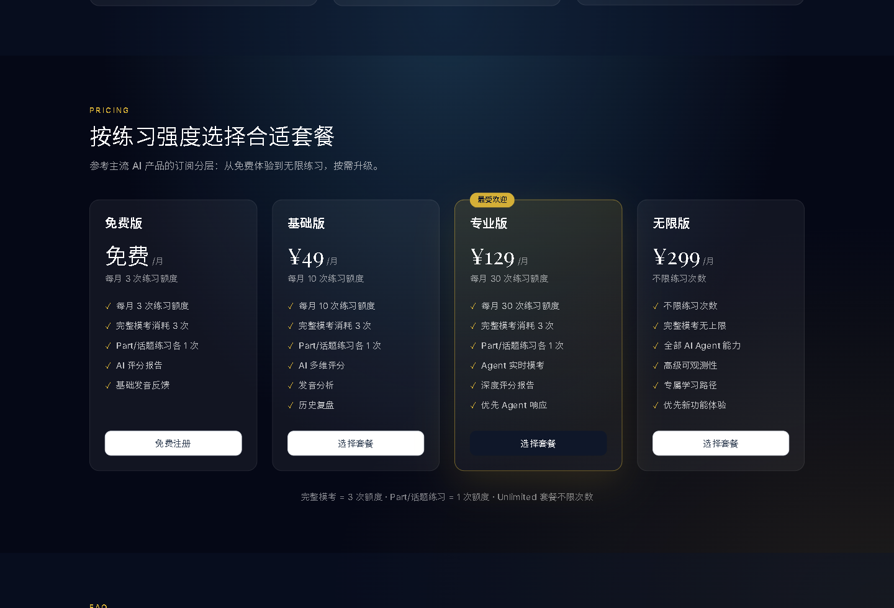
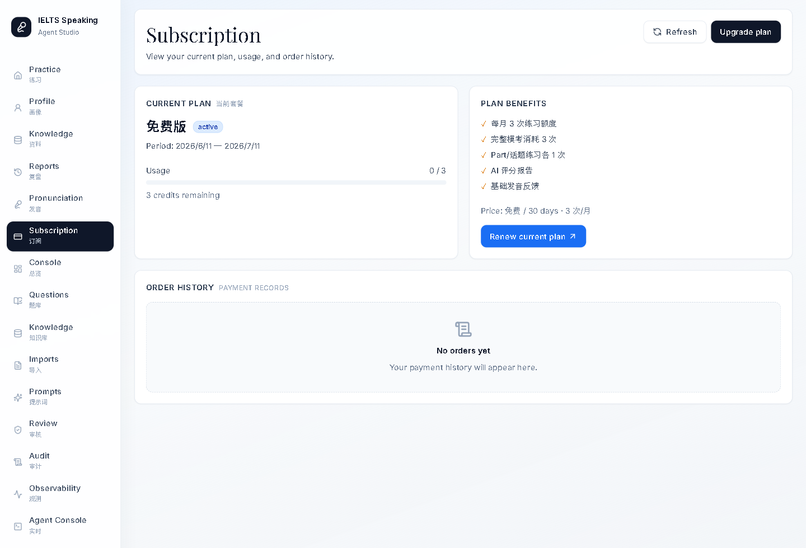
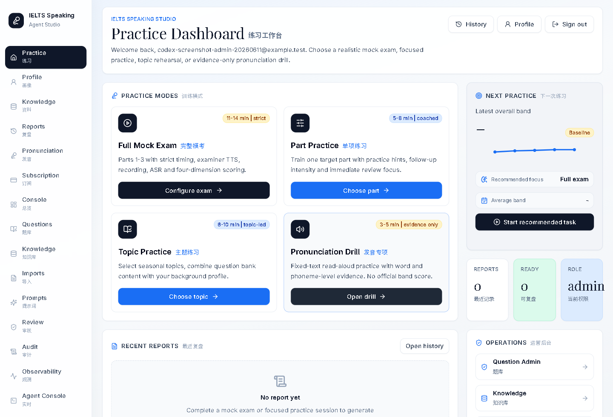
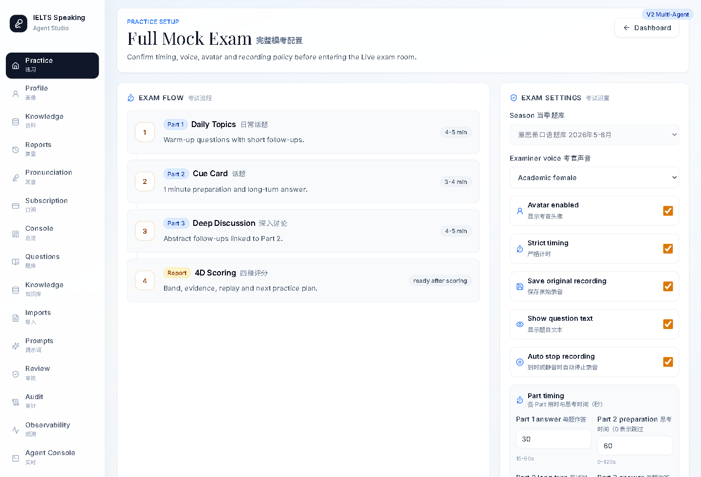
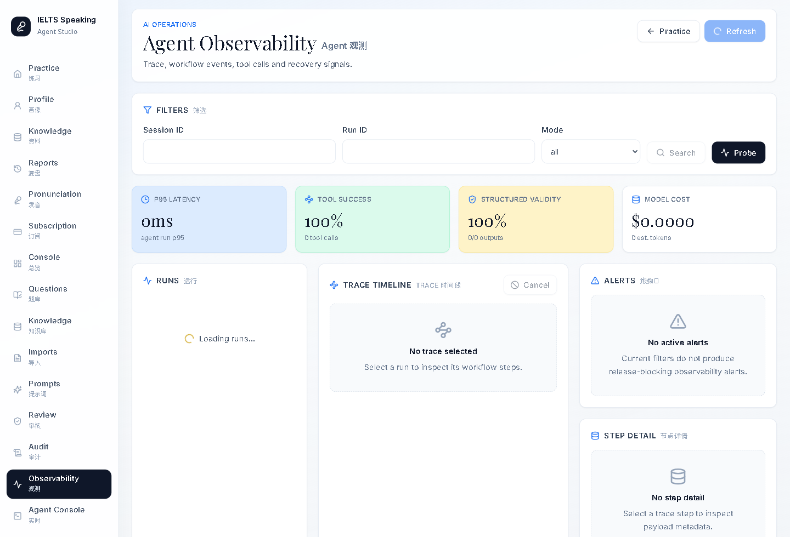
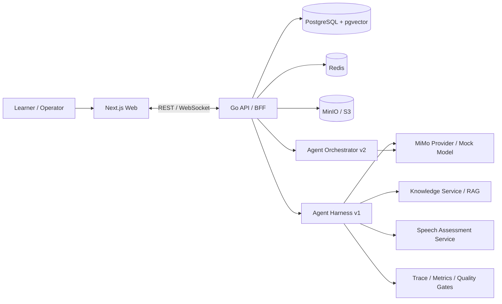

# IELTS Speaking Agent Studio

IELTS Speaking Agent Studio 是一个面向雅思口语备考的 AI 训练与考试工作台。产品把完整 Part 1-3 模考、专项练习、题库与知识库、语音证据、Agent 追问评分、复盘报告、订阅与运营观测放在同一套工程体系里，既服务学习者的日常训练，也服务运营团队对内容、模型和质量门禁的持续管理。

系统采用 monorepo 管理 Next.js Web、Go API/BFF、Python Agent Harness、Python Agent Orchestrator、Speech Assessment Service、共享协议 schema 与本地 Docker 基础设施。默认本地环境可通过 Docker Compose 启动，并提供注册登录、订阅额度、练习会话、录音上传、ASR/TTS、四维评分、历史复盘、后台审计、Agent Trace 与质量评测等闭环能力。

> AI 评分与反馈仅用于练习参考，不代表 IELTS 官方成绩。

## 产品界面

| 定价与订阅 | 学习者订阅 |
|---|---|
|  |  |

| 训练工作台 | 完整模考配置 |
|---|---|
|  |  |

| Agent 观测 |
|---|
|  |

## 核心能力

- 训练模式：完整模考、Part 专项、主题练习、发音专项训练。
- 考试流程：Part 1 短问答、Part 2 cue card、Part 3 抽象追问、严格计时、暂停恢复与评分触发。
- 语音链路：浏览器录音、对象存储、ASR 转写、TTS 考官语音、签名 URL 回放、语音质量与流利度指标。
- 评分复盘：四维 band、证据摘录、个性化建议、参考答案、下一轮训练建议、历史趋势和复盘回放。
- Agent 能力：题组规划、追问决策、评分工作流、RAG 上下文、MCP 工具、模型路由、Trace 持久化和可恢复错误策略。
- 运营后台：题库、知识库导入、Prompt 元信息、内容审核、订阅管理、RBAC、审计日志、Agent 观测和校准评测。
- 商业化边界：免费、基础、专业、无限套餐，按练习额度管理训练消耗，支持模拟支付流程和后台手动调整。

## 架构总览



| 层 | 技术栈 | 职责 |
|---|---|---|
| Web | Next.js 15、React 19、TypeScript、Tailwind、Recharts | 登录注册、练习设置、Live 控制台、录音、报告、历史、发音训练、订阅与运营后台 |
| Go API / BFF | Go 1.23、Gin、Goose | 鉴权、业务 API、WebSocket Gateway、会话状态、音频资产、报告持久化、后台 RBAC、审计和数据库迁移 |
| Agent Harness | Python 3.12、FastAPI、Pydantic | 组卷、考试/练习工作流、追问、评分、反馈、RAG、MCP、模型路由、Trace 和质量门禁 |
| Agent Orchestrator | Python 3.12、FastAPI | ExamDirector 与 Specialist 多 Agent 编排、Tool Loop、SSE 可观测性，与 v1 协议兼容 |
| Speech Assessment | Python 3.12、FastAPI | ASR 时间戳、语音质量、流利度、发音 evidence 和专项发音训练边界 |
| Data | PostgreSQL + pgvector、Redis、MinIO/S3 | 业务数据、向量检索、缓存/实时预留和音频对象存储 |
| Protocol | JSON Schema、Ajv | SessionEvent、Agent API、Agent Run、Scoring Report、Speech Assessment 契约 |

## 工作流

1. 用户登录后维护背景画像，隐私排除字段在 Profile MCP 与 Agent 上下文中被过滤。
2. Web 创建练习或考试会话，Go API 校验身份、额度和会话状态。
3. Agent Harness 或 Agent Orchestrator 生成题组计划、首轮事件、追问策略和评分任务。
4. Live 页面通过 WebSocket/SSE 接收事件，驱动考官消息、计时器、录音状态和会话阶段。
5. 用户音频上传到 Go API，音频进入 MinIO/S3，ASR/TTS 与 speech metrics 写入数据库。
6. ScoringWorkflow 结合 rubric、回答文本、语音 evidence 和 RAG 上下文生成结构化评分报告。
7. Web 报告页展示四维分、证据、音频回放、参考答案、复盘摘要和下一轮训练建议。
8. 运营后台管理题库、知识库、Prompt、订阅、审计、Trace、评测校准和质量门禁。

## 仓库结构

```text
apps/
  web/                     Next.js 前端应用
services/
  api-go/                  Go + Gin 业务 API / BFF
  agent-harness/           Python FastAPI Agent Harness
  agent-orchestrator/      Python FastAPI 多 Agent 编排引擎
  speech-assessment/       Python FastAPI 语音 evidence 服务
  worker/                  异步任务预留目录
packages/
  protocol/                前端、Go API 与 Agent 共享 JSON Schema
infra/                     部署与基础设施配置预留目录
docs/                      架构、配置、数据、发布、合规与评测文档
scripts/                   迁移审计、备份恢复、发布记录与 staging readiness 脚本
```

## 本地启动

### 前置依赖

- Docker Desktop 或兼容 Docker Compose 的运行环境
- Node.js 22、pnpm 9.12.3
- Go 1.23
- Python 3.12

只使用 Docker Compose 启动完整环境时，Node/Go/Python 主要用于本地测试和单服务开发。

### Docker Compose

```powershell
Copy-Item .env.example .env
docker compose up -d --build postgres redis minio agent-harness agent-orchestrator speech-assessment
docker compose run --rm api-go migrate up
docker compose up -d --build api-go web
```

启动后访问：

| 服务 | 地址 |
|---|---|
| Web | http://localhost:3000 |
| Go API healthz | http://localhost:18080/healthz |
| Go API readyz | http://localhost:18080/readyz |
| Agent Harness | http://localhost:8000/healthz |
| Agent Orchestrator | http://localhost:8100/healthz |
| Speech Assessment | http://localhost:8010/healthz |
| MinIO Console | http://localhost:9001 |

常用命令：

```powershell
docker compose ps
docker compose logs -f api-go
docker compose logs -f web
docker compose down
```

### 本地开发

```powershell
pnpm install --frozen-lockfile
pnpm --filter @ielts-speaking/web dev
```

```powershell
cd services/api-go
go run ./cmd/api migrate up
go run ./cmd/api
```

```powershell
cd services/agent-harness
python -m venv .venv
.\.venv\Scripts\Activate.ps1
pip install -r requirements.txt
uvicorn app.main:app --reload --port 8000
```

```powershell
cd services/speech-assessment
python -m venv .venv
.\.venv\Scripts\Activate.ps1
pip install -r requirements.txt
uvicorn app.main:app --reload --port 8010
```

## 配置与密钥

仓库只提交 `.env.example` 和 `.env.staging.example`。真实 `.env` 已被 `.gitignore` 排除，不要提交任何供应商 URL、API key、JWT secret、S3 secret、Langfuse secret 或生产数据库连接串。

| 配置组 | 关键变量 | 说明 |
|---|---|---|
| Web | `WEB_PORT`、`NEXT_PUBLIC_API_BASE_URL`、`NEXT_PUBLIC_AGENT_EVENT_SOURCE` | 浏览器访问 Go API 的公开地址默认是 `http://localhost:18080` |
| Go API | `API_HOST_PORT`、`API_HTTP_PORT`、`DATABASE_URL`、`REDIS_URL`、`JWT_SECRET`、`AUTH_CAPTCHA_TTL_SECONDS`、`AUTH_EMAIL_CODE_*`、`SMTP_*` | `API_HOST_PORT` 是宿主机端口，注册邮箱验证码本地可走日志，部署时配置 SMTP |
| Billing | `SUBSCRIPTION_*`、相关迁移与后台接口 | 控制套餐、额度、订单和用户订阅状态 |
| Agent | `AGENT_HARNESS_URL`、`MOCK_MODEL_ENABLED`、`MIMO_API_KEY`、`MIMO_BASE_URL`、`MIMO_API_FORMAT`、`MIMO_MODEL_ROUTES_JSON` | 本地可用 mock 模型，真实模型只在 `.env` 或部署密钥中配置 |
| Knowledge / RAG | `KNOWLEDGE_STORE_BACKEND`、`KNOWLEDGE_DATABASE_URL`、`DOCUMENT_INGESTION_*`、`KNOWLEDGE_MAX_UPLOAD_BYTES` | 支持 memory 与 pgvector；文档导入 Agent 可异步解析知识材料 |
| Object Storage | `S3_ENDPOINT`、`S3_PUBLIC_ENDPOINT`、`S3_ACCESS_KEY`、`S3_SECRET_KEY`、`MINIO_BUCKET` | 用于音频对象存储和浏览器可访问的短期 signed URL |
| Observability | `LANGFUSE_ENABLED`、`LANGFUSE_PUBLIC_KEY`、`LANGFUSE_SECRET_KEY`、`TRACE_USER_HASH_SALT`、`TRACE_PERSISTENCE_ENABLED`、`TRACE_DATABASE_URL` | 本地 trace 可持久化到 PostgreSQL，Langfuse 作为可选外部导出 |
| Speech | `SPEECH_ASSESSMENT_URL`、`SPEECH_ASSESSMENT_MODE`、`SPEECH_ASR_TIMESTAMP_PROVIDER` | 控制语音 evidence、ASR 时间戳与发音评测边界 |

配置说明见 [docs/configuration.md](docs/configuration.md)。

## 数据库与迁移

迁移文件位于 `services/api-go/internal/db/migrations`，通过 `go:embed` 打入 Go 二进制，并由 Goose 执行。

```powershell
pnpm db:migrate
pnpm db:status
pnpm migration:audit
```

核心数据域包括：

- 用户、背景问卷、隐私排除与 consent records
- season、topic、question、cue card、follow-up template
- subscription plan、order、quota usage 和用户订阅状态
- practice session、part、turn、audio asset、ASR result、speech metrics
- knowledge docs/chunks 与 pgvector embedding
- agent runs、model calls、score reports、criteria、feedback、reference answers、study plans
- admin audit logs、prompt versions、内容审核状态

## 质量门禁

CI 在 push 和 pull request 上执行协议校验、Web lint/typecheck/build、Go 测试、Agent Harness 测试、Speech Assessment 测试、语音评测 contract gate、Docker Compose 校验、迁移审计、staging readiness 示例校验、发布记录示例校验和服务镜像构建。

本地常用命令：

```powershell
pnpm protocol:validate
pnpm lint:web
pnpm typecheck:web
pnpm --filter @ielts-speaking/web build
pnpm test:api
pnpm test:agent
pnpm test:speech
pnpm eval:speech-calibration:contract
pnpm eval:multipa:contract
pnpm compose:config
pnpm compose:staging:config
```

## 安全与合规

- 真实 `.env`、构建产物、依赖目录、虚拟环境、运行日志、录屏和本地 artifacts 不进入版本控制。
- `JWT_SECRET`、`SMTP_PASSWORD`、`MIMO_API_KEY`、`S3_SECRET_KEY`、`LANGFUSE_SECRET_KEY`、`TRACE_USER_HASH_SALT` 必须通过环境或密钥管理系统注入。
- 音频回放通过短期 signed URL，不暴露永久对象地址。
- Agent Trace 和 model call 摘要不得保存完整 ASR 文本、Bearer token、邮箱、密钥或 base64 音频。
- Profile MCP 默认过滤 `private`、`is_excluded` 和用户显式排除的背景事实。
- 后台管理接口要求 `operator` 或 `admin` 角色，关键操作写入 `admin_audit_logs`。
- Prompt 后台只暴露 hash、版本、用途等 redacted 元信息，不向前端暴露系统提示全文。

## Agent 架构

| 维度 | V1 Agent Harness | V2 Agent Orchestrator |
|---|---|---|
| 服务 | `services/agent-harness` (:8000) | `services/agent-orchestrator` (:8100) |
| 编排 | 确定性工作流 + 单 Agent 节点 | ExamDirector + Specialist + MessageBus |
| Web 路由 | `/live/{id}`、`/practice/setup/*` | `/v2/live/{id}`、`/v2/practice/setup/*` |
| BFF 代理 | `/api/agent-harness/*` | `/api/agent-orchestrator/*` |
| ASR/TTS | Harness 内置 | V2 Live 复用 Harness ASR，考试主流程走 Orchestrator |

本地测试 Orchestrator：

```powershell
cd services/agent-orchestrator
pytest tests -q --ignore=tests/test_real_model_integration.py
$env:REAL_MODEL_TESTS='1'
pytest tests/test_real_model_integration.py -v
```

## 关键文档

- [架构基线](docs/adr/0001-architecture-baseline.md)
- [配置与密钥](docs/configuration.md)
- [数据库 schema](docs/database_schema.md)
- [MVP 范围](docs/mvp_scope.md)
- [Agent Runtime 边界](docs/agent_runtime_boundary.md)
- [隐私合规控制](docs/privacy_compliance_controls.md)
- [发布检查清单](docs/release_checklist.md)
- [Go API README](services/api-go/README.md)
- [Agent Orchestrator README](services/agent-orchestrator/README.md)
