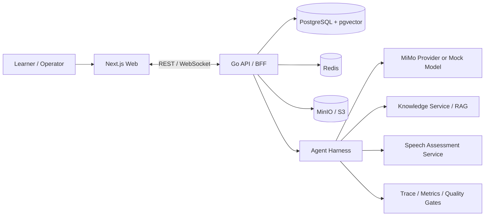

# IELTS Speaking Platform

面向雅思口语备考的 AI 练习、模拟考试、语音证据提取与复盘评分平台。仓库采用 monorepo 管理 Next.js Web、Go API/BFF、Python Agent Harness、Python Speech Assessment Service、共享协议 schema 与本地 Docker 基础设施。

当前状态是 MVP 工程闭环已打通：本地环境可通过 Docker Compose 启动，核心链路覆盖注册登录、背景问卷、题库管理、练习/考试会话、WebSocket 实时事件、录音上传、ASR/TTS、语音指标、Agent 组卷/追问/评分/反馈、报告持久化、历史报告和运营后台。生产化仍需要接入正式密钥、HTTPS、密钥管理、真实样本校准、备份监控和发布流程。

> 本项目输出的是练习用 AI 模拟评分与反馈，不代表 IELTS 官方成绩。

## 核心能力

- 三种口语训练模式：`full_exam`、`part_practice`、`topic_practice`。
- Part 1 / Part 2 / Part 3 流程控制：题组规划、cue card、计时语义、追问、结束与评分触发。
- 语音链路：浏览器录音、音频上传、ASR 结果持久化、人工修正、TTS 考官音频、签名 URL 回放。
- 评分与复盘：四维评分、证据、建议、参考答案、下一轮训练计划、历史报告筛选与趋势展示。
- 内容与运营：题库 CRUD、知识库文档、Prompt 版本、内容审核、后台 RBAC 与审计日志。
- Agent 工程边界：MiMo 模型适配、ModelRouter、RAG、MCP 工具、安全中间件、Trace、质量门禁与可恢复错误策略。
- 语音 evidence 服务：word timestamps、audio quality、fluency metrics、GOPT-compatible pronunciation evidence 和 pronunciation drill。

## 架构总览



### 分层职责

| 层 | 技术栈 | 职责 |
|---|---|---|
| Web | Next.js 15、React 19、TypeScript、Tailwind、Recharts | 登录注册、练习设置、Live 控制台、录音、报告、历史、发音练习、运营后台 |
| Go API / BFF | Go 1.23、Gin、Goose | 鉴权、业务 API、WebSocket Gateway、会话状态、音频资产、报告持久化、后台 RBAC、审计、数据库迁移 |
| Agent Harness | Python 3.12、FastAPI、Pydantic | 组卷、考试/练习工作流、追问、评分、反馈、RAG、MCP、模型路由、Trace、质量门禁 |
| Speech Assessment | Python 3.12、FastAPI | ASR 时间戳、语音质量、流利度、发音 evidence、专项发音训练边界 |
| Data | PostgreSQL + pgvector、Redis、MinIO/S3 | 业务数据、向量检索、实时/缓存预留、音频对象存储 |
| Protocol | JSON Schema、Ajv | SessionEvent、Agent API、Agent Run、Scoring Report、Speech Assessment 契约 |

### 运行原理

1. 用户登录后填写背景问卷，隐私排除字段会在 Profile MCP 与 Agent 上下文中被过滤。
2. Web 创建练习或考试会话，Go API 校验身份并持久化 `practice_sessions`、`session_parts`、`session_turns`。
3. Go API 调用 Agent Harness 的 `/agent/sessions/{session_id}/plan` 获取题组计划和首轮事件。
4. Live 页面通过 WebSocket Gateway 接收 `session.started`、`part.started`、`examiner.message`、`timer.started` 等共享协议事件。
5. 用户录音上传到 Go API，音频进入 MinIO/S3，ASR/TTS 与 speech metrics 写入数据库并绑定 turn。
6. Agent Harness 消费 ASR 状态，决定追问、下一题、进入下一 Part 或触发评分。
7. ScoringWorkflow 结合 rubric、用户回答、语音 evidence、RAG 上下文生成结构化评分报告。
8. Go API 保存报告、四维分、反馈项、参考答案和训练计划；Web 报告页与历史页读取并展示。
9. 后台页面管理题库、知识库、Prompt 和内容审核；所有管理操作进入审计日志。

## 仓库结构

```text
apps/
  web/                     Next.js 前端应用
services/
  api-go/                  Go + Gin 业务 API / BFF
  agent-harness/           Python FastAPI Agent Harness
  speech-assessment/       Python FastAPI 语音 evidence 服务
  worker/                  异步任务预留目录
packages/
  protocol/                前端、Go API 与 Agent 共享 JSON Schema
infra/                     部署与基础设施配置预留目录
docs/                      架构、配置、数据、发布、合规与评测文档
scripts/                   迁移审计、备份恢复、发布记录与 staging readiness 脚本
```

## 本地启动

### 前置依赖

- Docker Desktop 或兼容 Docker Compose 的运行环境
- Node.js 22、pnpm 9.12.3
- Go 1.23
- Python 3.12

如果只使用 Docker Compose 启动完整环境，Node/Go/Python 主要用于本地测试和单服务开发。

### Docker Compose 推荐流程

```powershell
Copy-Item .env.example .env
docker compose up -d --build postgres redis minio agent-harness speech-assessment
docker compose run --rm api-go migrate up
docker compose up -d --build api-go web
```

启动后访问：

| 服务 | 地址 |
|---|---|
| Web | http://localhost:3000 |
| Go API healthz | http://localhost:18080/healthz |
| Go API readyz | http://localhost:18080/readyz |
| Agent Harness | http://localhost:8000/healthz |
| Speech Assessment | http://localhost:8010/healthz |
| MinIO Console | http://localhost:9001 |

常用运维命令：

```powershell
docker compose ps
docker compose logs -f api-go
docker compose down
```

### 本地开发命令

```powershell
pnpm install --frozen-lockfile
pnpm --filter @ielts-speaking/web dev
```

```powershell
cd services/api-go
go run ./cmd/api migrate up
go run ./cmd/api
```

```powershell
cd services/agent-harness
python -m venv .venv
.\.venv\Scripts\Activate.ps1
pip install -r requirements.txt
uvicorn app.main:app --reload --port 8000
```

```powershell
cd services/speech-assessment
python -m venv .venv
.\.venv\Scripts\Activate.ps1
pip install -r requirements.txt
uvicorn app.main:app --reload --port 8010
```

## 配置与密钥

仓库只提交 `.env.example` 和 `.env.staging.example`。真实 `.env` 已被 `.gitignore` 排除，不要提交任何真实供应商 URL、API key、JWT secret、S3 secret、Langfuse secret 或生产数据库连接串。

| 配置组 | 关键变量 | 说明 |
|---|---|---|
| Web | `WEB_PORT`、`NEXT_PUBLIC_API_BASE_URL`、`NEXT_PUBLIC_AGENT_EVENT_SOURCE` | 浏览器访问 Go API 的公开地址默认是 `http://localhost:18080` |
| Go API | `API_HOST_PORT`、`API_HTTP_PORT`、`DATABASE_URL`、`REDIS_URL`、`JWT_SECRET` | `API_HOST_PORT` 是宿主机端口，`API_HTTP_PORT` 是容器内服务端口 |
| Agent | `AGENT_HARNESS_URL`、`MOCK_MODEL_ENABLED`、`MIMO_API_KEY`、`MIMO_BASE_URL`、`MIMO_API_FORMAT`、`MIMO_MODEL_ROUTES_JSON` | 本地默认启用 mock 模型，真实模型只在 `.env` 或部署密钥中配置 |
| Knowledge / RAG | `KNOWLEDGE_STORE_BACKEND`、`KNOWLEDGE_DATABASE_URL`、`KNOWLEDGE_EMBEDDING_DIMENSION` | 默认 `memory`，可切换到 `pgvector` |
| Object Storage | `S3_ENDPOINT`、`S3_PUBLIC_ENDPOINT`、`S3_ACCESS_KEY`、`S3_SECRET_KEY`、`MINIO_BUCKET` | `S3_PUBLIC_ENDPOINT` 用于生成浏览器可访问的签名 URL |
| Observability | `LANGFUSE_ENABLED`、`LANGFUSE_PUBLIC_KEY`、`LANGFUSE_SECRET_KEY`、`TRACE_USER_HASH_SALT` | 本地默认只保留内存 trace，生产必须替换 hash salt |
| Speech | `SPEECH_ASSESSMENT_URL`、`SPEECH_ASSESSMENT_MODE`、`SPEECH_ASR_TIMESTAMP_PROVIDER` | MVP 默认 deterministic evidence 边界 |

Staging 示例配置可用以下命令做占位校验：

```powershell
pnpm staging:readiness:example
```

更完整的配置说明见 `docs/configuration.md`。

## 数据库与迁移

迁移文件位于 `services/api-go/internal/db/migrations`，通过 `go:embed` 打入 Go 二进制，并由 Goose 执行。当前迁移覆盖核心 schema、ASR 修正、TTS 缓存、speech metrics、后台审计、内容运营、报告反馈和隐私合规控制。

```powershell
pnpm db:migrate
pnpm db:status
pnpm migration:audit
```

核心数据域包括：

- 用户、背景问卷、隐私排除与 consent records
- season、topic、question、cue card、follow-up template
- practice session、part、turn、audio asset、ASR result、speech metrics
- knowledge docs/chunks 与 pgvector embedding
- agent runs、model calls、score reports、criteria、feedback、reference answers、study plans
- admin audit logs、prompt versions、内容审核状态

## 质量门禁

CI 会在 push 和 pull request 上执行协议校验、Web lint/typecheck/build、Go 测试、Agent Harness 测试、Speech Assessment 测试、语音评测 contract gate、Docker Compose 校验、迁移审计、staging readiness 示例校验、发布记录示例校验和四个服务镜像构建。

本地常用命令：

```powershell
pnpm protocol:validate
pnpm lint:web
pnpm typecheck:web
pnpm test:api
pnpm test:agent
pnpm test:speech
pnpm eval:speech-calibration:contract
pnpm eval:multipa:contract
pnpm compose:config
pnpm compose:staging:config
```

## 当前进度

| 模块 | 状态 | 说明 |
|---|---|---|
| 工程底座 | 已完成 | monorepo、Docker Compose、CI、环境示例、协议 schema、迁移脚本和协作规范已建立 |
| Web | 已完成 MVP 主链路 | 登录注册、背景、练习设置、Live 控制台、报告、历史、发音练习、运营后台页面已实现 |
| Go API | 已完成 MVP 主链路 | 鉴权、题库、会话、WebSocket、音频、ASR、TTS、报告、后台 RBAC、审计、隐私 API 已覆盖 |
| Agent Harness | 已完成 MVP 主链路 | 题组规划、考试/练习状态机、追问、评分、反馈、RAG、MCP、Trace、质量门禁已实现 |
| Speech Assessment | 已完成 evidence 边界 | 时间戳、语音质量、流利度、发音 evidence 和 pronunciation drill 已实现 deterministic adapter |
| 数据层 | 已完成核心 schema | PostgreSQL/pgvector 迁移覆盖业务、内容、Agent、报告、审计和合规数据 |
| 观测与评测 | 已建立基线 | 本地 trace、Prometheus metrics、Langfuse 导出边界、校准和 MultiPA contract gate 已具备 |
| 生产化 | 待推进 | HTTPS、正式密钥管理、真实模型 smoke、真实语音样本校准、备份监控、部署 IaC 和深度 Agent Framework 图编排仍需落地 |

## 安全与合规边界

- 真实 `.env`、构建产物、依赖目录、虚拟环境、运行日志、录屏和本地 artifacts 不进入版本控制。
- `JWT_SECRET`、`MIMO_API_KEY`、`S3_SECRET_KEY`、`LANGFUSE_SECRET_KEY`、`TRACE_USER_HASH_SALT` 必须通过环境或密钥管理系统注入。
- 音频回放必须通过短期 signed URL，不暴露永久对象地址。
- Agent Trace 和 model call 摘要不得保存完整 ASR 文本、Bearer token、邮箱、密钥或 base64 音频。
- Profile MCP 默认过滤 `private`、`is_excluded` 和用户显式排除的背景事实。
- 后台管理接口要求 `operator` 或 `admin` 角色，关键操作写入 `admin_audit_logs`。
- Prompt 后台只暴露 hash、版本、用途等 redacted 元信息，不向前端暴露系统提示全文。

## 关键文档

- `docs/adr/0001-architecture-baseline.md`：系统架构基线
- `docs/configuration.md`：环境变量与密钥管理
- `docs/database_schema.md`：数据库 schema 与迁移说明
- `docs/mvp_scope.md`：MVP 范围与验收口径
- `docs/agent_runtime_boundary.md`：Agent Runtime 与 Microsoft Agent Framework 适配边界
- `docs/privacy_compliance_controls.md`：隐私合规控制
- `docs/release_checklist.md`：发布检查清单
- `services/api-go/README.md`：Go API 接口说明
- `services/agent-harness/README.md`：Agent Harness 工作流与模型边界
