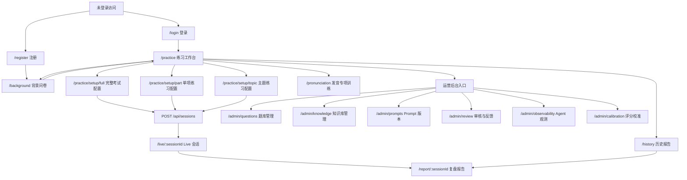
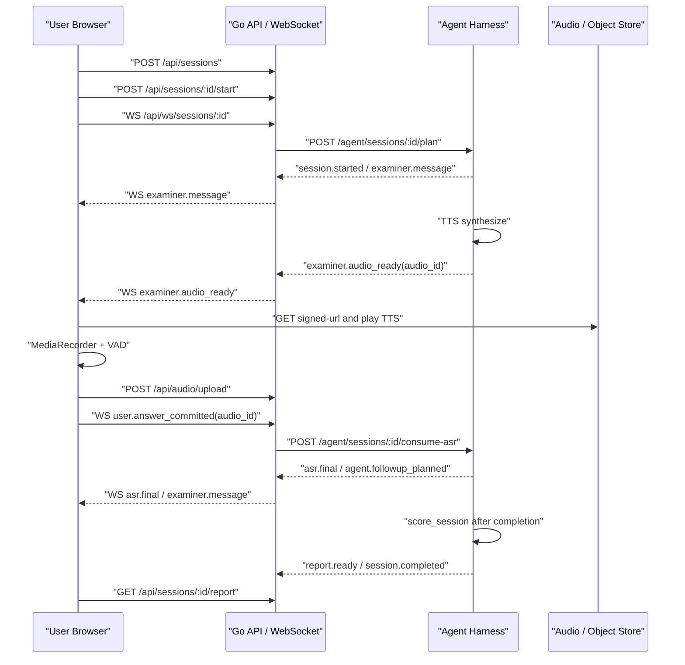

# IELTS Speaking UI/UX 页面规划、生图提示词与接口联动说明

> 文档版本：v1.0  
> 生成日期：2026-06-08  
> 依据文档：`ielts_speaking_agent_harness_plan.md`、`ielts_speaking_project_task_checklist.md`、现有 `apps/web` 页面与 Go / Agent Harness API  
> 目标用途：用于产品 UI/UX 统一规划、ChatGPT 网页 gpt-image-2 生图、前端迭代拆分、交互与后端接口对齐。

---

## 1. 设计总判断

本项目不是泛聊天工具，而是一个“可控、可评测、可复盘”的 IELTS Speaking 训练系统。界面应像一个安静、可信、专业的考试训练舱：降低装饰噪声，把用户注意力集中在题目、时间、录音状态、转写证据和下一步行动上。

### 1.1 选定风格

采用 `$ui-ux-pro-max` 决策框架后，推荐风格为：

**IELTS Academic Live Studio：优雅学术风格 + 实时考试控制台 + 数据化教练系统**

核心关键词：

- 专业、克制、学术、可信。
- 实时感强，但不做游戏化夸张动效。
- 数据密度高，但信息层级清晰。
- 深色 Live 场景为主，浅色或半浅色表单场景作为缓冲。
- 学习产品要让用户“愿意回看复盘”，所以报告页要比后台更温和、更有教练感。

### 1.2 与当前实现的关系

当前前端已经具备：

- `Next.js + React + TypeScript + Tailwind CSS + shadcn/ui`。
- `Inter + Playfair Display` 字体。
- `academic.gold / navy / slate / teal` 色板。
- Live 控制台、报告页、历史页、题库后台、知识库后台、Prompt 后台、审核后台。
- `RadarChart`、`ExaminerAvatar`、`ReplayAudioPanel`、录音、TTS 播放、WebSocket 会话事件。

本文档延续现有“优雅学术”方向，但补充两点：

- 避免全站只由深蓝/深灰支配。用户端可加入 ivory、paper、sage、coral 等辅助色，增强层次。
- 将规划中的 Part Practice、Topic Practice、Pronunciation Drill、Observability、Calibration 等页面补齐为后续设计目标。

---

## 2. 设计系统

### 2.1 色彩体系

| 用途 | 色值 | 使用建议 |
|---|---:|---|
| Ink Navy | `#0B132B` | Live 页和全局深色背景，面积不超过页面视觉的 45% |
| Academic Slate | `#1C2541` | 主面板背景、侧栏、后台表格容器 |
| Paper Ivory | `#F7F4EA` | 登录、注册、背景问卷的浅色纸张区域或空状态插画背景 |
| Academic Gold | `#D4AF37` | 主 CTA、当前考试节点、关键分数、雷达图主色 |
| Teal Blue | `#3A7CA5` | 次级行动、连接状态、信息标签、进度线 |
| Sage Green | `#4F8A6B` | 成功、已完成、授权已开启、健康状态 |
| Coral | `#E76F51` | 时间警告、低置信度提醒、需要复核的内容 |
| Red | `#EF4444` | 录音停止、删除、危险操作 |
| Text Primary Dark | `#F8FAFC` | 深色背景主文本 |
| Text Secondary Dark | `#CBD5E1` | 深色背景说明文本 |
| Text Muted Dark | `#94A3B8` | 次要元信息，不能用于正文长段落 |
| Border Dark | `rgba(255,255,255,0.10)` | 深色卡片边框 |
| Panel Glass | `rgba(28,37,65,0.72)` | 深色玻璃面板，配合 `backdrop-blur` |

图表色：

- Fluency：`#D4AF37`
- Lexical：`#3A7CA5`
- Grammar：`#8B5CF6`
- Pronunciation：`#4F8A6B`
- Warning / Low confidence：`#E76F51`

### 2.2 字体与文本层级

| 层级 | 字体 | 尺寸建议 | 使用 |
|---|---|---:|---|
| H1 | Playfair Display | 32-40px | 页面标题、报告 Overall Band |
| H2 | Playfair Display | 24-30px | Live 考官话术、主要板块标题 |
| H3 | Inter Semibold | 16-20px | 卡片标题、表格组标题 |
| Body | Inter Regular | 14-16px | 正文、说明、表单 |
| Meta | Inter Medium | 11-13px | 标签、状态、时间、置信度 |
| Mono | 系统等宽字体 | 12-14px | Trace ID、hash、JSON、session id |

文本原则：

- Live 页英文问题必须居中、可读、行高充足，不被按钮或头像遮挡。
- 后台页不要使用大号营销标题，保持操作密度。
- 所有危险操作需要明确红色语义和确认机制。
- AI 评分免责声明始终出现在报告页底部和评分概览附近。

### 2.3 组件规范

| 组件 | 视觉与交互规范 |
|---|---|
| 主按钮 | Gold 背景、Ink Navy 文本、左侧 Lucide 图标，hover 提亮，不放大造成布局抖动 |
| 次按钮 | 深色透明背景、白色 10% 边框、hover 到白色 10% 填充 |
| 危险按钮 | Red 或 red translucent，带 `Trash2` / `Square` 等明确图标 |
| Icon Button | 用于返回、播放、重听、设置、归档、刷新，必须有 tooltip 或 `title` |
| 卡片 | 8px 圆角为默认；Live 主舞台可以 12px，但后台表格和重复项保持 8px |
| 表单 | label 在上，输入框高度 44px，focus 使用 Gold 边框，不用大面积发光 |
| 标签 | 小圆角矩形，显示 mode、Part、status、source、confidence 等 |
| Toast / Notice | 成功用 Gold 或 Sage，错误用 Red；不覆盖核心按钮 |
| Modal | 只用于删除确认、录音授权、发布审核等不可轻量完成的动作 |

### 2.4 图表规范

| 图表 | 页面 | 设计 |
|---|---|---|
| 四维雷达图 | Live 预览、Report | Gold 半透明填充，白色低对比网格，四维固定顺序 |
| Overall Band 趋势线 | History | Gold 折线，点位可 hover，Y 轴 0-9 |
| 评分维度柱状/条形图 | Calibration | 四维分数和 MAE 对比，低置信度用 Coral |
| Agent Trace 时间线 | Observability | 左侧事件时间轴，右侧模型/工具调用详情 |
| 内容状态分布 | Review Board | Draft / Reviewing / Active / Archived 小型堆叠条或计数卡 |
| 延迟/成本指标 | Observability | 小型 sparkline + P50/P95/P99 指标卡 |

### 2.5 响应式规则

- 1440px：采用 12 栅格，Live 页为左 Timeline、中主舞台、右 Review。
- 1024px：Live 页可保持三栏，但右侧 Review 缩窄；后台页双栏。
- 768px：主导航折行，表单和后台筛选变两列。
- 390px：所有页面单列；Live 页按钮固定在底部安全区域，Cue Card 和字幕不互相遮挡。
- 所有图表必须有稳定高度，避免加载或数据变化导致布局跳动。

---

## 3. 页面信息架构与跳转关系



页面分组：

- 用户认证：登录、注册。
- 学习路径：背景问卷、练习工作台、练习配置、Live 会话、发音专项。
- 复盘增长：报告详情、历史趋势。
- 运营治理：题库、知识库、Prompt、审核、观测、校准。

---

## 4. 全局提示词

下面提示词用于先生成整体设计基调图，作为所有页面的视觉母版。

```text
为一个 IELTS Speaking 在线练习与模拟考试 Web App 生成一套高保真 UI 设计总览图，风格是 IELTS Academic Live Studio：优雅学术、专业考试控制台、数据化教练系统。画面展示多个产品页面缩略图组成的设计系统画板，包括登录、练习工作台、Live 口语考试、四维评分报告、历史趋势、题库后台、知识库后台、Agent 观测后台。

视觉要求：深色 Ink Navy 背景 #0B132B，Academic Slate 面板 #1C2541，Paper Ivory 局部浅色纸张区域，Academic Gold #D4AF37 作为主 CTA 和关键分数，Teal Blue #3A7CA5 表示连接状态和信息标签，Sage Green 表示完成状态，Coral 表示警告。字体感觉为 Inter + Playfair Display，标题优雅但不夸张，后台页面信息密度高。

组件要求：8px 圆角卡片、细边框、轻微 glass panel、Lucide 风格线性图标、雷达图、趋势折线图、Agent Trace 时间线、录音波形、倒计时、Cue Card、评分证据卡、参考答案卡、内容审核状态标签。不要营销海报，不要夸张渐变球体，不要卡片套卡片，不要 emoji 图标，不要过度装饰。布局要像真实可用的 SaaS/PWA 产品界面，桌面 1440px 宽，高保真、清晰、可直接交给前端实现。
```

---

## 5. 每页详细规划与生图提示词

### P01 登录页 `/login`

状态：已实现；已统一为 Academic Live Studio 视觉风格，并覆盖加载、错误与注册跳转状态。

页面目标：

- 让老用户快速进入练习。
- 提供注册跳转。
- 错误、加载、Token 刷新失败状态清晰。

排版：

- 居中 420px 宽表单面板。
- 左上角可放小型品牌标识 `IELTS Speaking Agent`。
- 背景可使用深色学术背景，面板使用 Paper Ivory 或深色 glass，两种都可；推荐登录页用浅色纸张面板，减少长时间深色疲劳。
- 表单底部有“Sign up”文字按钮。

关键控件：

- Email 输入框。
- Password 输入框。
- Sign in 主按钮，加载时显示 `Loader2`。
- Sign up 文本按钮。
- 错误提示条。

交互与接口：

| 交互 | 接口 | 成功 | 失败 |
|---|---|---|---|
| 点击 Sign in | `POST /api/auth/login` | 保存 access/refresh token，调用 `/api/me` 后跳转 `/practice` | 显示错误 |
| Token 恢复 | `POST /api/auth/refresh` | 静默刷新 | 跳回 `/login` |
| 点击 Sign up | 前端路由 `/register` | 进入注册页 | - |

页面提示词：

```text
生成一个 IELTS Speaking Agent 的登录页高保真 UI 截图，桌面 1440x1024。整体风格为 IELTS Academic Live Studio，深色 Ink Navy 背景，中央一个 420px 宽的 Paper Ivory 或半透明 slate 登录面板，8px 圆角，细边框，轻微阴影。顶部有小型品牌文字 IELTS Speaking Agent 和简洁麦克风线性图标。面板标题为 Welcome back，副标题为 Sign in to your IELTS speaking account。表单包含 Email 输入框、Password 输入框、一个 Academic Gold 主按钮 Sign in，按钮左侧可有 LogIn 图标，底部有 Don't have an account? Sign up 文本按钮。右下角可有极简的四维评分小雷达图水印，不要营销 hero，不要人物照片，不要 emoji，所有按钮和输入框间距紧凑、专业、适合教育 SaaS。
```

### P02 注册页 `/register`

状态：已实现；已与登录页统一为同一视觉模板，并在成功注册后进入背景问卷。

页面目标：

- 创建账号。
- 注册完成后进入背景问卷。
- 强化“先建立个人练习画像”的路径预期。

排版：

- 与登录页同模板。
- 可在右侧或底部显示 3 个轻量步骤：Account、Profile、Practice。

关键控件：

- Display Name。
- Email。
- Password，提示最少 8 位。
- Sign up 主按钮。
- Sign in 文本按钮。

交互与接口：

| 交互 | 接口 | 成功 | 失败 |
|---|---|---|---|
| 点击 Sign up | `POST /api/auth/register` | 保存 token，调用 `/api/me`，跳转 `/background` | 显示错误 |
| 点击 Sign in | 前端路由 `/login` | 进入登录页 | - |

页面提示词：

```text
生成一个 IELTS Speaking Agent 注册页高保真 UI，桌面 1440x1024。风格与登录页一致：Ink Navy 背景、Paper Ivory 或 glass slate 表单面板、Academic Gold 主按钮。面板标题 Create an account，副标题 Enter your details to get started。输入项依次为 Display Name、Email、Password，Password 下方有小号提示 at least 8 characters。右侧或面板底部有三步 onboarding 指示器：Account、Profile、Practice，Account 高亮为 Academic Gold，后两步为 muted slate。底部有 Already have an account? Sign in。界面应干净、可信、像专业考试训练产品，不要营销大图，不要夸张装饰。
```

### P03 背景问卷与隐私控制 `/background`

状态：已实现并已增强；已对齐后端 `profile`、`questionnaire.answers`、`facts`、`privacy_exclusions` 契约，支持 IELTS 个性化字段与隐私排除预览。

页面目标：

- 收集用户背景事实，服务 Part 1 / Part 2 个性化追问和参考答案。
- 让用户理解哪些信息会进入 Agent。
- 支持删除背景资料。

排版：

- 桌面采用左右双栏：左侧问卷，右侧隐私摘要与个性化预览。
- 移动端单列，隐私控制在保存按钮下方。
- 页面顶部返回 Practice。

关键控件：

- Native Language 输入。
- Target Band 数字 stepper，范围 1-9，步长 0.5。
- Exam Date 日期选择。
- Study Goal 输入。
- Hobbies 输入。
- Weaknesses 多选或标签输入。
- Privacy Exclusions 标签输入，例如 workplace、family、medical。
- Free Note 文本域。
- Save Profile 主按钮。
- Skip for now 次按钮。
- Delete Background 危险区，需要输入 `DELETE_MY_DATA`。

交互与接口：

| 交互 | 接口 | 成功 | 失败 |
|---|---|---|---|
| 页面加载 | `GET /api/me/background` | 填充问卷 | 404 时显示空表单 |
| 保存 | `PUT /api/me/background` | 跳转 `/practice` | 显示错误 |
| 删除背景 | `POST /api/privacy/data-deletion`，`delete_background=true` | 清空表单并提示成功 | 显示错误 |

页面提示词：

```text
生成 IELTS Speaking Agent 的背景问卷与隐私控制页面，桌面 1440x1100。采用优雅学术 SaaS 风格，深色 Ink Navy 背景，主内容 max-width 1100。顶部标题 Your Profile，副标题 Tell us about yourself to personalize your IELTS practice，右上角有 Practice 返回按钮。主体双栏：左侧宽栏为 Personalization Form，包含 Basic Information、IELTS Goal、Speaking Preferences 三个分组，输入控件包括 Native Language、Target Band stepper、Exam Date date picker、Study Goal、Hobbies、Weaknesses tag input、Free Note textarea；右侧窄栏为 Privacy Controls，展示 Agent personalization preview、Privacy exclusions chips、一个红色 Delete Background Profile 危险区，包含确认输入框 DELETE_MY_DATA 和 Delete background 按钮。使用 Academic Gold 高亮保存按钮，Teal 标签，Red 危险操作，所有卡片 8px 圆角，不要卡片套卡片，布局清晰可操作。
```

### P04 练习工作台 `/practice`

状态：已实现；Full Mock Exam、Part Practice、Topic Practice 与 Pronunciation Drill 均已有可进入的配置/训练入口。

页面目标：

- 作为登录后的主入口。
- 展示模式选择、最近趋势、下一步建议、后台入口。
- 区分普通用户与 operator/admin。

排版：

- 顶部：欢迎语、用户身份、History、Edit Profile、Sign out。
- 中部：三种练习模式卡片。
- 右侧或下方：最近分数、弱点、下一次训练计划。
- Operator/Admin 才显示后台快捷入口。

关键控件：

- Start Full Exam。
- Configure Part Practice。
- Choose Topic Practice。
- Pronunciation Drill。
- History。
- Edit Profile。
- Admin: Question Admin、Knowledge、Prompts、Review、Observability、Calibration。

交互与接口：

| 交互 | 接口 | 成功 | 失败 |
|---|---|---|---|
| 页面鉴权 | `GET /api/me` | 显示用户与角色 | 未登录跳 `/login` |
| Start Full Exam | `POST /api/sessions` mode=`full_exam`，再 `POST /api/sessions/:id/start` | 跳 `/live/:id` | 错误提示 |
| 打开历史 | 前端路由 `/history` | 历史页 | - |
| 打开后台 | 前端路由 `/admin/*` | 后台页 | 非 operator/admin 显示 Access denied |

页面提示词：

```text
生成 IELTS Speaking Agent 练习工作台 Dashboard，高保真桌面 1440x1100。风格为专业学术训练控制台，深色 Ink Navy 背景，内容区 max-width 1180。顶部左侧显示 Dashboard 和 Welcome back，右侧是一排紧凑按钮：History、Edit Profile、Sign out，operator 视角还显示 Question Admin、Knowledge、Prompts、Review、Observability。中部主区是三张并列模式卡片：Full Mock Exam、Part Practice、Topic Practice，每张卡片有 Lucide 图标、说明、预计时长、严格程度标签、Academic Gold 或 Teal 操作按钮。右侧或下方有 Next Practice 小面板，显示上次 Overall Band、四维弱项 chips、一个 mini trend sparkline 和 Start recommended task 按钮。页面信息密度适中，像真实 SaaS 工作台，不要营销 hero，不要大型插画。
```

### P05 完整考试配置页 `/practice/setup/full`

状态：已实现。

页面目标：

- 在进入 Live 前设置考试模式。
- 让用户确认录音保存策略、考官声音、Avatar、严格计时。
- 避免 Live 页开始后再做复杂配置。

排版：

- 左侧：模式说明和 Part 1/2/3 流程。
- 右侧：设置面板。
- 底部固定 Start Mock Exam CTA。

关键控件：

- Season 选择。
- Examiner voice 选择。
- Avatar toggle。
- Save original recording toggle。
- Strict timing toggle，默认开启。
- Microphone pre-check。
- Start Mock Exam。

交互与接口：

| 交互 | 接口 | 成功 | 失败 |
|---|---|---|---|
| 获取 active season | `GET /api/seasons/active` | 默认选中当季题库 | 显示无题库状态 |
| 创建会话 | `POST /api/sessions` mode=`full_exam` | 返回 session id | 错误提示 |
| 开始会话 | `POST /api/sessions/:id/start` | 跳 `/live/:id` | 错误提示 |
| 录音授权检查 | `GET /api/privacy/consents?consent_type=recording` | 已授权则通过 | 未授权可在 Live 页确认 |

页面提示词：

```text
生成 IELTS Speaking Full Mock Exam 配置页，桌面 1440x1000。深色学术风格，左侧 60% 是完整考试流程预览：Part 1 Daily Topics、Part 2 Cue Card、Part 3 Deep Discussion、Final Report 四个步骤组成垂直时间线，每个步骤有预计时间和小图标。右侧 40% 是 Exam Settings 面板，包含 Season select、Examiner Voice select、Avatar toggle、Strict Timing toggle、Save Original Recording toggle、Microphone Check 状态条。底部右侧有 Academic Gold 主按钮 Start Mock Exam，旁边有 Back to Dashboard 次按钮。界面应强调真实考试、严肃、可控，使用 Gold 表示开始，Teal 表示已连接/已准备，Sage 表示通过检查，Coral 表示警告。
```

### P06 单项练习配置页 `/practice/setup/part`

状态：已实现；后端与 Agent 已支持 `part_practice`。

页面目标：

- 选择 Part 1 / Part 2 / Part 3。
- 选择是否显示提示、是否立即评分、是否针对弱项练习。
- 用于比完整考试更高频的训练。

排版：

- 顶部分段控件选择 Part。
- 中间根据 Part 展示差异化配置。
- 右侧显示训练目标和上次弱点。

关键控件：

- Part segmented control。
- Topic select。
- Hints toggle。
- Follow-up intensity slider。
- Question count stepper。
- Start Part Practice。

交互与接口：

| 交互 | 接口 | 成功 | 失败 |
|---|---|---|---|
| 获取 topics | `GET /api/topics` | 渲染 topic 选择 | 空状态 |
| 创建练习 | `POST /api/sessions` mode=`part_practice`，带 `target_part`、topic | 返回 session id | 错误提示 |
| 开始练习 | `POST /api/sessions/:id/start` | 跳 Live | 错误提示 |

页面提示词：

```text
生成 IELTS Speaking Part Practice 配置页，高保真桌面 1440x1000。顶部标题 Part Practice，下面是 Part 1、Part 2、Part 3 三段式 segmented control，当前 Part 2 高亮 Academic Gold。左侧主面板显示 Part 2 训练设置：Topic select、Cue Card category select、Question count stepper、Preparation hints toggle、Follow-up intensity slider、Immediate scoring toggle。右侧教练面板显示 Last weakness、Recommended focus、Target band、预计训练时间，并有一个小型四维雷达图突出 Pronunciation 和 Fluency 弱项。底部有 Start Part Practice 主按钮和 Dashboard 次按钮。界面专业、紧凑、不是营销页，按钮带线性图标，所有控件清晰可点击。
```

### P07 主题练习配置页 `/practice/setup/topic`

状态：已实现；后端与 Agent 已支持 `topic_practice`。

页面目标：

- 按当季主题和个人弱项练习。
- 将题库、主题知识、用户背景结合。

排版：

- 左侧主题网格。
- 右侧选中主题详情，包括 Part 覆盖、题量、常见词汇。
- 底部 Start Topic Practice。

关键控件：

- Season filter。
- Topic search。
- Topic cards。
- Part checkbox group。
- Personalize with background toggle。
- Start Topic Practice。

交互与接口：

| 交互 | 接口 | 成功 | 失败 |
|---|---|---|---|
| 获取 topics/questions | `GET /api/topics`、`GET /api/questions` | 渲染主题和题量 | 空状态 |
| 创建练习 | `POST /api/sessions` mode=`topic_practice`，带 topic id | 返回 session id | 错误提示 |
| 开始练习 | `POST /api/sessions/:id/start` | 跳 Live | 错误提示 |

页面提示词：

```text
生成 IELTS Speaking Topic Practice 主题练习配置页，高保真桌面 1440x1000。整体为数据化学术工作台。顶部有 Season selector 和 Topic search 输入框。主体左侧为主题卡片网格，每张卡片显示主题名如 Hometown、Work and Study、Technology、Travel、题目数量、Part 覆盖 chips、review status active。右侧固定详情面板显示选中主题 Technology，包括 Part 1/2/3 question distribution 小条形图、Common vocabulary chips、Personalize with my background toggle、Practice strategy 提示。底部有 Academic Gold 按钮 Start Topic Practice。使用 Teal 作为标签，Gold 高亮选中卡片，Sage 表示 active 内容，布局像真实内容检索与练习配置界面。
```

### P08 Live 会话页 `/live/:sessionId`

状态：已实现并已按控制台原型强化三栏布局；保留 consent、upload、WebSocket、VAD、ASR、TTS 状态机。

页面目标：

- 完成 Part 1/2/3 Live 考试或练习。
- 控制考官说话、TTS 播放、录音、VAD、ASR、追问、Part 切换。
- 保持状态可见但不干扰表达。

排版：

- 桌面三栏：左 Timeline，中间 Live Stage，右 Session / Review Preview。
- 移动端：顶部进度条，中间考官和字幕，下方 Cue Card / 录音按钮。
- Part 2 时 Cue Card 必须显著，但不能遮挡录音按钮。

关键控件：

- ExaminerAvatar：idle / speaking / listening。
- 字幕区域。
- AudioPlayer 自动播放。
- Replay Question。
- Start Speaking / Finish。
- Recording Consent 卡片。
- Timer。
- Waveform。
- Cue Card。
- ASR echo。
- 网络状态指示。
- 可恢复错误提示。

WebSocket 事件：

| 事件 | UI 反应 |
|---|---|
| `session.started` | 时间线激活 Part 1 |
| `part.started` | 切换当前 Part |
| `examiner.thinking` | 主舞台显示 thinking loading |
| `examiner.message` | 更新考官文本、Cue Card、timer policy |
| `examiner.audio_ready` | 播放 TTS，Avatar speaking |
| `timer.started` | 启动准备或回答倒计时 |
| `user.recording_started` | Avatar listening，波形变红 |
| `user.silence_detected` | 自动停止录音并提示 |
| `user.answer_committed` | 上传后进入 ASR processing |
| `asr.processing` | 显示转写中 |
| `asr.final` | 显示 ASR echo |
| `agent.followup_planned` | 准备追问 |
| `part.completed` | 时间线完成当前 Part |
| `scoring.started` | 转入评分 |
| `report.ready` / `session.completed` | 跳转报告页 |
| `error.recoverable` | 顶部轻量错误条，允许重试 |
| `error.fatal` | 中断并返回 Practice |

REST / 资源接口：

| 交互 | 接口 |
|---|---|
| 查询录音授权 | `GET /api/privacy/consents?consent_type=recording` |
| 保存录音授权 | `POST /api/privacy/consents` |
| WebSocket 连接 | `GET /api/ws/sessions/:id?access_token=...` |
| 上传录音 | `POST /api/audio/upload` |
| TTS 音频签名 URL | `GET /api/audio/:id/signed-url` |
| 会话完成后报告 | `GET /api/sessions/:id/report` |

页面提示词：

```text
生成 IELTS Speaking Live Session 页面，高保真桌面 1440x1100。风格为专业实时考试控制台，深色 Ink Navy 背景。采用三栏布局：左侧 260px Session Timeline，包含 Part 1、Part 2、Part 3、Report 四个节点，当前 Part 2 高亮 Gold，已完成节点为 Sage；中间主舞台是 Examiner 区域，顶部显示 Live Session 和 WebSocket connected 状态，中间有圆形 Examiner Avatar，状态为 speaking，周围有低调脉冲环，下面显示考官问题英文字幕。Part 2 时在字幕下方显示 Cue Card 面板：Describe a person who inspired you，附 4 条 bullet points，右上角准备倒计时 00:47。底部是录音控制区：左侧音频波形，右侧倒计时，中央有红色 Finish 圆形按钮，旁边有 Replay Question、Report Issue、Microphone Status 小按钮。右侧 320px 面板显示 Session Summary、ASR Echo、Current Turn、mini radar review preview。界面要真实可用，不要营销文字，不要过度发光，不要 emoji，按钮必须有线性图标，文字不重叠。
```

### P09 发音专项训练页 `/pronunciation`

状态：已实现；Speech Assessment Service 已有 `/speech/pronunciation-drill` 能力。

页面目标：

- 固定文本跟读，提供词级/音素级/重音反馈。
- 与自由 IELTS Mock Exam 分轨，不输出官方分。

排版：

- 左侧固定文本和朗读步骤。
- 中间录音与波形。
- 右侧词级反馈热力图和建议。

关键控件：

- Drill text selector。
- Play model audio。
- Record。
- Stop。
- Retry。
- Word heatmap。
- Phoneme detail drawer。
- 保存本次 drill。

接口：

| 交互 | 接口 | 说明 |
|---|---|---|
| 上传录音 | `POST /api/audio/upload` | 存储跟读音频 |
| 发音专项评测 | Speech service `POST /speech/pronunciation-drill` 或经 Go/Agent 代理 | 输出 word/phoneme feedback |
| 查看音频 | `GET /api/audio/:id/signed-url` | 回放 |

页面提示词：

```text
生成 IELTS Pronunciation Drill 页面，高保真桌面 1440x1000。界面是专业发音专项训练工具，不是考试页。左侧为 Drill Script 面板，显示一句英文固定文本，单词分成可点击 tokens，当前词有 Gold 下划线。中间为 Record Studio，包含 model audio 播放按钮、用户录音波形、大号 Record/Stop 按钮、retry 按钮、录音质量指示。右侧为 Pronunciation Evidence 面板，展示 Word-level heatmap：绿色表示准确，Coral 表示需练习，点击单词后显示 phoneme-level detail、stress feedback、prosody note。顶部有提示：Practice evidence only, not an official IELTS band。使用 Ink Navy、Slate、Gold、Teal、Sage、Coral，布局清晰、数据化、可操作。
```

### P10 报告详情页 `/report/:sessionId`

状态：已实现；是产品信任感核心页面。

页面目标：

- 展示 Overall Band、四维分数、置信度、证据和建议。
- 支持录音回放、转写核对、参考答案、训练计划。
- 收集用户对评分/建议/参考答案反馈。

排版：

- 顶部：Session Report、返回 Practice。
- 主区左：Score Overview + 雷达图 + 四维评分卡。
- 右侧：Summary、Report Feedback、Feedback、Next Practice。
- 下方：ReplayAudioPanel + Reference Answer。
- 底部：AI 评分免责声明。

关键控件：

- RadarChart。
- Criterion cards。
- Evidence quote。
- Suggestion list。
- Thumbs up/down。
- Comment textarea。
- Send feedback。
- Replay audio list。
- Reference answer skeleton。

接口：

| 交互 | 接口 |
|---|---|
| 加载会话 turn | `GET /api/sessions/:id` |
| 加载报告 | `GET /api/sessions/:id/report` |
| 提交反馈 | `POST /api/reports/:report_id/feedback` |
| 回放音频 | `GET /api/audio/:id/signed-url` |

页面提示词：

```text
生成 IELTS Speaking Session Report 页面，高保真桌面 1440x1200。深色学术报告风格，顶部标题 Session Report，副标题 Review scores, evidence, feedback, reference answers, and replay audio，右侧 Practice 返回按钮。主体采用两栏：左侧宽栏 Score Overview，显示 Overall Band 6.5、Confidence 78%、Version 1、mode full_exam，右侧嵌入四维雷达图；下方四个评分卡片：Fluency、Lexical、Grammar、Pronunciation，每张卡片右上角 band badge，内部有 Evidence 引用块、Reason、Suggestions，两枚紧凑的 thumbs up/down 反馈按钮。右侧窄栏包括 Summary、Report Feedback 文本框和 Send 按钮、Feedback 教练建议卡、Next Practice 计划卡。页面下方双栏：左侧 Session Replay 音频回放列表和转写，右侧 Reference Answer，包含 answer skeleton 和 personalized notes。底部有免责声明 AI scoring is for practice reference only, not official IELTS results。使用 Gold 表示分数，Teal 表示证据，Coral 表示低置信度提醒，整体专业可信。
```

### P11 历史报告页 `/history`

状态：已实现。

页面目标：

- 跟踪整体分数趋势。
- 按 mode、part、日期筛选。
- 进入具体报告或删除会话数据。

排版：

- 顶部返回 Practice。
- 筛选条。
- 趋势图 + 指标卡。
- 报告列表。

关键控件：

- Mode select。
- Part select。
- From / To date。
- Apply / Reset。
- Overall Band Trend。
- Reports list。
- Open review。
- Delete。

接口：

| 交互 | 接口 |
|---|---|
| 查询历史 | `GET /api/reports?mode=&part=&from=&to=&limit=&offset=` |
| 打开报告 | 前端路由 `/report/:sessionId` |
| 删除会话数据 | `POST /api/privacy/data-deletion`，`delete_recordings=true`，`delete_reports=true` |

页面提示词：

```text
生成 IELTS Speaking Report History 页面，高保真桌面 1440x1100。深色数据分析风格，顶部标题 Report History，右侧 Practice 返回按钮。第一块为 Filters 横向筛选条，包含 Mode select、Part select、From date、To date、Apply、Reset。第二块为两栏：左侧 Overall Band Trend 折线图，Gold 折线从 5.5 到 6.5，Y 轴 0-9，顶部显示 Latest band、Average、Delta；右侧三张指标卡：Reports、Ready、Latest。第三块为 Reports 列表，每条报告显示 overall band badge、mode、part、report status、created date、confidence、四维 chips，右侧有 Open review 和 Delete 按钮。Delete 使用红色边框。布局紧凑、图表清晰、可用于长期学习追踪。
```

### P12 题库管理页 `/admin/questions`

状态：已实现。

页面目标：

- 管理季度题库、topic、Part、source、license、review_status。
- 支持创建、编辑、批量导入、归档。
- 确保未审核内容不进入公开题库和 RAG。

排版：

- 顶部：Content Operations / Question Admin。
- 筛选区。
- 左侧创建/编辑表单，右侧批量导入。
- 底部题目列表。

关键控件：

- Season select。
- Topic select。
- Part select。
- Status select。
- Question Text。
- Source。
- License。
- Difficulty。
- Part 2 Cue Card Prompt / Bullet Points。
- Save。
- Clear。
- Batch JSON textarea。
- Import。
- 列表中 Edit、Archive、status select。

接口：

| 交互 | 接口 |
|---|---|
| 读 seasons | `GET /api/admin/question-bank/seasons` |
| 读 topics | `GET /api/admin/question-bank/topics` |
| 读 questions | `GET /api/admin/question-bank/questions` |
| 创建题目 | `POST /api/admin/question-bank/questions` |
| 更新题目 | `PUT /api/admin/question-bank/questions/:id` |
| 归档题目 | `DELETE /api/admin/question-bank/questions/:id` |
| 创建/更新 season/topic | `POST/PUT/DELETE /api/admin/question-bank/seasons|topics` |

页面提示词：

```text
生成 IELTS Speaking 后台 Question Admin 页面，高保真桌面 1440x1200。风格为专业内容运营后台，深色 Slate 面板，信息密度高但清晰。顶部标题 Content Operations / Question Admin，右侧 Practice 返回按钮。第一块 Filters 横向条：Season、Topic、Part、Status select，Apply、Reset 按钮。第二块为双栏：左侧 Create Question 表单，包含 Season、Topic、Part、Review Status、Source、Difficulty、Question Text、License；当 Part 2 被选中时显示 Cue Card Prompt 和 Bullet Points 文本域；底部有 Save 和 Clear。右侧 Batch Import 面板，包含 Batch JSON 大文本域和 Import 按钮。底部 Questions 列表，每条题目有 Part、review_status、source_type、season、topic badges，正文问题，Part 2 cue card 摘要，右侧 status select、Edit、Archive 按钮。使用 Gold 高亮保存，Teal 表示筛选，Red/Slate 表示归档，像真实运营后台。
```

### P13 知识库管理页 `/admin/knowledge`

状态：已实现。

页面目标：

- 上传 topic knowledge、rubric、review history。
- 触发 reindex。
- 管理知识文档状态和索引状态。

排版：

- 顶部：Knowledge Admin。
- 筛选条。
- 左侧 Upload Document。
- 右侧 Index Status 列表。

关键控件：

- Doc Type select。
- Status select。
- Title。
- Content textarea。
- Metadata JSON textarea。
- Save Document。
- Reindex。
- Archive。
- 状态 chips：doc_type、status、index_status、chunk count。

接口：

| 交互 | 接口 |
|---|---|
| 查询文档 | `GET /api/admin/knowledge/docs` |
| 创建文档 | `POST /api/admin/knowledge/docs` |
| 更新状态 | `PUT /api/admin/knowledge/docs/:id` |
| 重新索引 | `POST /api/admin/knowledge/docs/:id/reindex` |
| 归档 | `DELETE /api/admin/knowledge/docs/:id` |

页面提示词：

```text
生成 IELTS Speaking 后台 Knowledge Admin 页面，高保真桌面 1440x1100。深色专业后台风格。顶部标题 Content Operations / Knowledge Admin，副标题 Topic knowledge, scoring material and review-history indexing。筛选区包含 Doc Type、Status、Apply、Reset。主体双栏：左侧 Upload Document 表单，包含 Doc Type select、Status select、Title input、Content textarea、Metadata JSON textarea、Save Document Gold 按钮；右侧 Index Status 列表，每条文档有 doc_type、status、index_status、chunk count badges，标题、content hash、token count、embedding model，右侧 Reindex 和 Archive 按钮。需要呈现 RAG/pgvector 知识索引感，使用 Teal 数据标签、Gold 操作、Sage indexed 状态、Coral failed 状态。
```

### P14 Prompt 版本页 `/admin/prompts`

状态：已实现。

页面目标：

- 查看 Prompt 版本元信息。
- 不暴露系统提示全文。
- 支持按 agent、purpose、active 过滤。

排版：

- 顶部：AI Operations / Prompt Admin。
- 筛选条。
- Prompt version 卡片网格。

关键控件：

- Agent select。
- Purpose select。
- Active select。
- Apply。
- Reset。
- Prompt cards：agent、purpose、active、redacted、version、summary、content_hash、rollback。

接口：

| 交互 | 接口 |
|---|---|
| 查询 Prompt versions | `GET /api/admin/prompts/versions?agent_name=&purpose=&active=` |

页面提示词：

```text
生成 IELTS Speaking 后台 Prompt Admin 页面，高保真桌面 1440x1000。风格为 AI Operations 控制台，深色 Ink Navy 背景和 Slate 卡片。顶部标题 AI Operations / Prompt Admin，副标题 Version metadata, active prompt catalog and rollback notes。筛选条包含 Agent select、Purpose select、Active select、Apply、Reset。主体为两列 Prompt Versions 卡片网格，每张卡片有 badges：examiner_agent、scoring、active、redacted；标题显示 version v1.3.0；正文显示 summary metadata；底部有 EyeOff 图标说明 Prompt body is not exposed in this UI，content_hash 等宽文本，Rollback 信息和 RotateCcw 图标。整体要突出安全、审计、版本治理，不展示任何完整 prompt 正文。
```

### P15 审核与反馈页 `/admin/review`

状态：已实现；可作为运营后台总览页。

页面目标：

- 汇总 question、knowledge_doc、reference_answer 的内容状态。
- 查看用户对报告的反馈。
- 管理 Voice Clone 策略。
- 审核参考答案发布状态。

排版：

- 顶部：Review Board，快捷到 Questions、Knowledge、Practice。
- 三个 Summary 卡。
- User Feedback 列表 + Export JSON。
- Voice Clone Policy。
- Reference Answer Review。

关键控件：

- SummaryPanel：Draft / Reviewing / Active / Archived。
- Export JSON。
- Feedback cards with ThumbsUp / ThumbsDown。
- Voice Clone Enable / Disable。
- Reference status select。

接口：

| 交互 | 接口 |
|---|---|
| 状态汇总 | `GET /api/admin/content-review/summary` |
| 参考答案列表 | `GET /api/admin/content-review/reference-answers?status=` |
| 更新参考答案状态 | `PUT /api/admin/content-review/reference-answers/:id/status` |
| 用户反馈导出 | `GET /api/reports/feedback/export` |
| 获取 Voice Clone 策略 | `GET /api/admin/compliance/voice-clone-policy` |
| 更新 Voice Clone 策略 | `PUT /api/admin/compliance/voice-clone-policy` |

页面提示词：

```text
生成 IELTS Speaking 后台 Review Board 页面，高保真桌面 1440x1200。风格为内容质量与合规审核中心。顶部标题 Content Quality / Review Board，右侧按钮 Questions、Knowledge、Practice。第一行三张 Summary 卡：Questions、Knowledge Docs、Reference Answers，每张卡显示总数和 draft/reviewing/active/archived 四个状态计数。第二块 User Feedback，右上角 Export JSON 按钮，列表中每条反馈显示 target_type、thumbs up/down、日期、comment、report id、session id。第三块 Voice Clone Policy，显示 enabled/disabled badge、Disable、Enable 按钮，并标注 explicit consent required。第四块 Reference Answer Review，右侧 status select，列表中每条参考答案显示 review_status、Band target、created date、answer_text、personalization notes，以及状态下拉框。使用 Gold 表示主要状态，Red 表示风险操作，Sage 表示 active，Coral 表示 reviewing。
```

### P16 Agent 观测页 `/admin/observability`

状态：已实现；Agent Harness 已提供观测接口，Web BFF 通过 `/api/agent-harness/*` 代理访问。

页面目标：

- 查看 Agent Run、Trace、工具调用、模型延迟、错误与恢复。
- 连接 Langfuse / OTEL 的业务可读视图。
- 用于排查 Live 会话状态不同步、评分失败、RAG 命中差。

排版：

- 顶部筛选：session_id、run_id、mode、time range。
- 左侧 Run 列表。
- 中间 Trace timeline。
- 右侧 Step detail。
- 顶部指标卡：P95 latency、structured output validity、tool success rate、model cost。

关键控件：

- Search run。
- Mode select。
- Refresh。
- Cancel run。
- Trace step list。
- Tool call JSON drawer。
- Alert list。

接口：

| 交互 | 接口 |
|---|---|
| 观测摘要 | `GET /agent/observability/summary?session_id=&run_id=&mode=&limit=` |
| 观测告警 | `GET /agent/observability/alerts?session_id=&run_id=&mode=&limit=` |
| Run 详情 | `GET /agent/runs/:run_id` |
| Trace 详情 | `GET /agent/runs/:run_id/trace` |
| 取消 Run | `POST /agent/runs/:run_id/cancel` |
| 恢复指令 | `POST /agent/recovery/directive` |

页面提示词：

```text
生成 IELTS Speaking Agent Observability 后台页面，高保真桌面 1440x1200。风格为专业 AI 运维控制台。顶部标题 Agent Observability，副标题 Trace, workflow events, tool calls and recovery signals。顶部筛选条包含 session id 搜索框、run id 搜索框、mode select、time range、Refresh 按钮。下面一行四个指标卡：P95 Latency、Tool Success Rate、Structured Output Validity、Recoverable Errors，带小型 sparkline。主体三栏：左侧 Run 列表，显示 run_id、session_id、workflow_node、status、latency；中间 Trace Timeline，按时间显示 plan_session、examiner.message、asr.processing、score_session、report.ready 等节点，成功为 Sage，警告为 Coral，失败为 Red；右侧 Step Detail 面板展示 model name、tokens、retrieved chunks、tool calls、JSON schema validity、error policy，底部有 Cancel Run 按钮。使用等宽字体显示 id 和 JSON，不要杂乱，像真实可排障后台。
```

### P17 评分校准与样本管理页 `/admin/calibration`

状态：已实现；已接入 anchor samples、DeepEval、Ragas、Promptfoo、speech calibration 与 MultiPA contract gate 的 Agent Harness API。

页面目标：

- 管理 anchor samples。
- 查看四维评分漂移、MAE、confidence 分布。
- 跑回归评测和语音校准任务。

排版：

- 顶部 Quality Gate 状态。
- 左侧样本筛选与列表。
- 中间校准图表。
- 右侧运行评测按钮和结果摘要。

关键控件：

- Dataset select。
- Part filter。
- Band range slider。
- Accent / recording quality filter。
- Run Regression。
- Run Speech Calibration。
- Run Redteam。
- MAE bar chart。
- Score drift chart。
- Sample detail drawer。

接口：

| 交互 | 接口或服务 |
|---|---|
| 运行 Agent 回归 | `POST /agent/calibration/quality-gate` |
| RAG 评估 | `POST /agent/calibration/quality-gate` |
| Prompt 注入红队 | `POST /agent/calibration/quality-gate` |
| 语音校准 | `POST /agent/calibration/speech-regression` |
| MultiPA 实验 | `POST /agent/calibration/multipa-experiment` |

页面提示词：

```text
生成 IELTS Speaking Scoring Calibration 后台页面，高保真桌面 1440x1200。风格为 AI 质量评测仪表盘。顶部标题 Scoring Calibration，右侧显示 Quality Gate: Passed / Review / Failed 状态徽章。顶部四张指标卡：Overall MAE、Pronunciation MAE、Max Error、Sample Coverage。主体左侧为 Anchor Samples 列表，带 Dataset、Part、Band Range、Accent、Recording Quality 筛选；中间为图表区，包含四维 MAE bar chart、score drift line chart、confidence distribution histogram；右侧为 Evaluation Runs 面板，按钮包括 Run Regression、Run Speech Calibration、Run Prompt Injection Redteam、Run MultiPA Experiment，下面显示最近运行状态、耗时、通过率。底部样本详情表显示 transcript excerpt、human band、AI band、evidence confidence、reviewer notes。使用 Gold 强调通过指标，Coral 表示需要复核，Red 表示失败，布局像专业模型质量平台。
```

### P18 运营后台总览页 `/admin`

状态：已实现。

页面目标：

- 为 operator/admin 提供统一入口。
- 汇总内容、模型、报告反馈、合规状态。

排版：

- 顶部 Admin Console。
- 模块入口卡片。
- 本周待办。
- 系统健康。

关键控件：

- Questions。
- Knowledge。
- Prompts。
- Review。
- Observability。
- Calibration。
- Voice Clone Policy status。
- Latest audit logs。

接口：

| 模块 | 接口 |
|---|---|
| 内容汇总 | `GET /api/admin/content-review/summary` |
| Prompt 活跃版本 | `GET /api/admin/prompts/versions?active=true` |
| 用户反馈 | `GET /api/reports/feedback/export?limit=20` |
| Go 健康 | `GET /healthz`、`GET /readyz` |
| Agent 健康 | `GET /agent-harness /healthz`，实际经部署网关代理 |

页面提示词：

```text
生成 IELTS Speaking Admin Console 总览页，高保真桌面 1440x1000。深色专业运营工作台。顶部标题 Admin Console，副标题 Content, AI operations, compliance and quality gates。第一行 6 个模块入口卡片：Question Bank、Knowledge Base、Prompt Versions、Review Board、Agent Observability、Scoring Calibration，每张卡有 Lucide 图标、状态、待处理数量、Open 按钮。第二行左侧为 Content Queue 小型堆叠条图，显示 draft/reviewing/active/archived；中间为 System Health，显示 api-go、agent-harness、speech-assessment、postgres、redis、minio 的健康状态点；右侧为 Recent Feedback，显示 thumbs up/down 用户反馈摘要。底部为 Compliance Status：Recording consent、Data deletion、Voice clone disabled、Prompt redaction。界面要像真实后台首页，不要营销内容。
```

### P19 根路径入口页 `/`

状态：已实现为生产入口；未登录跳 `/login`，已登录跳 `/practice`，根路径不再承载视觉预览。

页面目标：

- 按登录态进入正确工作区。
- 在鉴权状态恢复期间显示轻量 loading。
- 保持生产根路径简单、可预测，不混入 demo 交互。

排版：

- 居中 loading 面板。
- 小型品牌标识。
- 不展示练习或后台内容。

关键控件：

- 无交互控件，仅自动跳转。

接口：

| 交互 | 接口 |
|---|---|
| Token 恢复 | Zustand persist auth state |
| 已登录 | 前端路由 `/practice` |
| 未登录 | 前端路由 `/login` |

页面提示词：

```text
生成 IELTS Speaking 根路径跳转页，高保真桌面 1440x900。页面只用于鉴权状态恢复和工作区跳转，背景为浅色学术工作台色，中央 420px 内有小型 IELTS Speaking 品牌标识、麦克风线性图标、Opening workspace 文案和 Loader2 loading。风格与登录页/Practice Dashboard 一致，不展示营销 hero，不展示练习控制台，不提供额外按钮。
```

### P20 Live 控制台视觉预览页 `/preview/live-console`

状态：已实现；承接原 P19 视觉预览能力，不占用生产根路径。

页面目标：

- 提供可独立打开的 Live Practice Console 高保真静态预览。
- 展示 Timeline、Examiner Stage、录音控制、Review Preview 和运行信号。
- 用于设计验收与视觉对齐，不调用真实会话接口。

---

## 6. 页面与后端联动总表

| 页面 | 核心前端状态 | Go API | Agent / Speech / WebSocket | 成功跳转 |
|---|---|---|---|---|
| `/login` | email、password、loading | `POST /api/auth/login`、`GET /api/me` | - | `/practice` |
| `/register` | display_name、email、password | `POST /api/auth/register`、`GET /api/me` | - | `/background` |
| `/background` | profile、answers、privacy_exclusions | `GET/PUT /api/me/background`、`POST /api/privacy/data-deletion` | profile-mcp 后续读取安全视图 | `/practice` |
| `/practice` | user、role、mode selection | `POST /api/sessions`、`POST /api/sessions/:id/start` | ExamWorkflow / PracticeWorkflow plan | `/live/:id` |
| `/practice/setup/full` | season、voice、recording policy | `GET /api/seasons/active`、`POST /api/sessions` | `/agent/sessions/:id/plan` | `/live/:id` |
| `/practice/setup/part` | target_part、topic、hints | `GET /api/topics`、`POST /api/sessions` | PracticeWorkflow + ModePolicy | `/live/:id` |
| `/practice/setup/topic` | topic_id、parts、personalize | `GET /api/topics`、`GET /api/questions`、`POST /api/sessions` | question-bank-mcp、profile-mcp | `/live/:id` |
| `/live/:id` | sessionState、timer、audio、asr | `GET/POST /api/privacy/consents`、`POST /api/audio/upload` | WS `/api/ws/sessions/:id`、Agent next-turn、ASR/TTS | `/report/:id` |
| `/pronunciation` | script、recording、word feedback | `POST /api/audio/upload`、`GET /api/audio/:id/signed-url` | `POST /speech/pronunciation-drill` | 留在本页 |
| `/report/:id` | session、report、feedbackForms | `GET /api/sessions/:id`、`GET /api/sessions/:id/report`、`POST /api/reports/:report_id/feedback` | report-mcp save output | - |
| `/history` | filters、reports、trend | `GET /api/reports`、`POST /api/privacy/data-deletion` | - | `/report/:id` |
| `/admin/questions` | filters、question form、import | `/api/admin/question-bank/*` | question-bank-mcp 使用 active 内容 | - |
| `/admin/knowledge` | docs、metadata、status | `/api/admin/knowledge/docs*` | LlamaIndex / pgvector index | - |
| `/admin/prompts` | prompt filters、versions | `GET /api/admin/prompts/versions` | Langfuse prompt 管理边界 | - |
| `/admin/review` | summary、feedback、voice policy | `/api/admin/content-review/*`、`/api/reports/feedback/export`、`/api/admin/compliance/voice-clone-policy` | report-mcp / content policy | - |
| `/admin/observability` | runs、trace、alerts、structured validity、model cost | Web BFF `/api/agent-harness/*` | `/agent/observability/*`、`/agent/runs/*`、`/metrics` | - |
| `/admin/calibration` | samples、eval runs、metrics、quality gate | Web BFF `/api/agent-harness/*` | `/agent/calibration/*`、DeepEval、Ragas、Promptfoo、speech calibration、MultiPA | - |
| `/preview/live-console` | static preview、timeline、review mock | - | - | - |

---

## 7. Live 会话详细交互时序



设计落点：

- `examiner.message` 到 `examiner.audio_ready` 之间，UI 不应立刻让用户录音，避免打断 TTS。
- `AudioPlayer.onFinished` 后才进入 `user_speaking`。
- 静音检测触发后要显示“Silence detected, processing your answer”，避免用户误以为录音丢失。已完成。
- Part 2 的 `timer.started purpose=preparation` 和回答倒计时要视觉区分：准备为 Gold，回答为 Red/Coral。
- `error.recoverable` 要给 Retry upload / Continue without audio 的可恢复路径。已完成：保留本地 audio blob，支持 Retry upload，也支持手动文本继续本轮。

---

## 8. 状态、空态与错误态要求

| 场景 | UI 处理 |
|---|---|
| 未登录访问受保护页 | hydration 完成后跳 `/login`，避免闪烁 |
| 无背景问卷 | Practice 提示完善资料，但不阻止开始练习 |
| 无题库 active season | Practice / setup 页显示内容待发布，不创建 session |
| 麦克风未授权 | Live 页显示授权说明和浏览器权限引导 |
| 录音上传失败 | 保留本地 blob 状态，提供 Retry Upload 与手动文本 Continue without audio |
| ASR 低置信度 | Report evidence 中标注 low confidence，不强行扣发音分 |
| Report 未生成 | Report 页保留 replay 和 transcript review |
| 后台 403 | Access denied 页，说明 operator/admin 可访问 |
| Prompt body redacted | Prompt 页只显示 hash 和 summary |
| Voice clone enabled | 必须显示 explicit consent required 和风险提示 |

---

## 9. 前端迭代建议

优先级建议：

1. `/live/:sessionId` 已强化为三栏控制台，并保留已实现的 consent、upload、WS 状态机。
2. 把后台页面抽出统一 `AdminShell`：顶部、返回、权限空态、notice/error、筛选条样式复用。
3. 继续统一危险操作确认体验；当前 History 删除已改为页面内确认短语。
4. 设计 demo 已新增 `/preview/live-console`，不占用生产根路径。

---

## 10. 生图执行方式建议

推荐生图顺序：

1. 先用“全局提示词”生成视觉母版。
2. 再按 P08 Live、P10 Report、P04 Practice 三个核心用户页生成主视觉。
3. 再生成后台四页：Question、Knowledge、Prompt、Review。
4. 最后生成新增页：Part/Topic setup、Pronunciation、Observability、Calibration。

每页建议生成两张：

- 桌面：1440px 宽，展示完整信息架构。
- 移动：390px 宽，验证核心控件不重叠。

生图时保持 UI 文案为英文，因为当前产品前端文案主要为英文；设计说明和开发文档保持中文。
