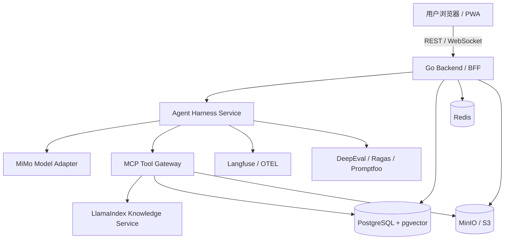
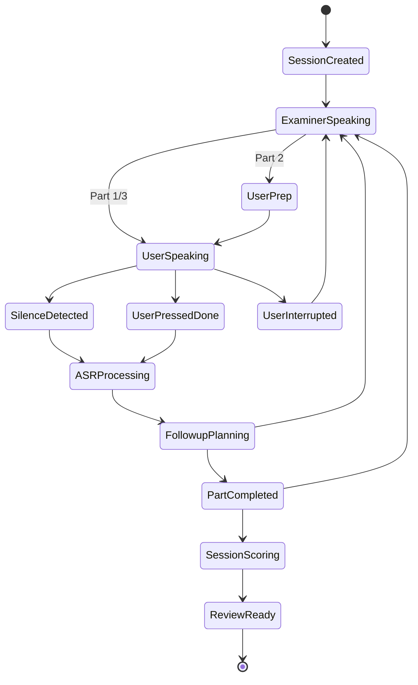

# 雅思口语练习网站：Agent Harness 核心层与整体项目详细规划

> 文档版本：v1.0  
> 适用阶段：MVP 立项、架构评审、研发排期、核心层原型落地  
> 核心目标：快速搭建一套稳定、可演进、可评测、可针对性修改的 Agent Harness 体系，并围绕雅思口语 Live 练习/考试体验持续优化。

---

## 1. 项目定位

本项目定位为一套面向 IELTS Speaking 的在线练习与模拟考试系统，覆盖网页端与移动端浏览器，重点不是普通 AI 聊天，而是：

1. **接近真实考试的 Live 口语考试流程**：Part 1、Part 2、Part 3 的完整流程、倒计时、停顿、追问、收束与复盘。
2. **基于季度题库与用户背景的针对性练习**：按当季题库、主题、Part 类型、用户背景事实、历史薄弱项生成练习和追问。
3. **稳定可控的多 Agent Harness**：支持工具、知识库、多协议、多 Agent 协作、评分、反馈、观测、回归评测。
4. **严格但谨慎的 IELTS 口语模拟评分**：参考官方评分维度，给出 Fluency & Coherence、Lexical Resource、Grammatical Range & Accuracy、Pronunciation 四维模拟分数、证据和建议。
5. **可持久化复盘与持续学习路径**：保留会话、录音、转写、评分、证据、改进建议、参考答案和下一轮训练计划。

系统对外展示时应明确：**AI 评分仅用于练习参考，不代表 IELTS 官方成绩。**

---

## 2. 总体技术选型结论

### 2.1 推荐核心组合

```text
Frontend / PWA
  - Next.js + React + TypeScript
  - Tailwind CSS + shadcn/ui + Radix UI
  - WebSocket + MediaRecorder + Web Audio API
  - Live2D Avatar MVP，Three.js/VRM 作为进阶

Go Backend
  - Go + Gin
  - Ent 或 GORM，优先 Ent
  - PostgreSQL + pgvector
  - Redis
  - MinIO / S3
  - REST API + WebSocket Gateway + Model Gateway

Agent Harness Service
  - Python FastAPI
  - Microsoft Agent Framework 1.0 作为主 Agent Harness
  - LlamaIndex 作为知识库/RAG 服务
  - MCP 作为工具协议
  - A2A 作为跨 Agent/跨框架协作协议
  - AG-UI 思路作为 Agent 到前端的事件协议

Evaluation / Observability
  - Langfuse：Trace、Prompt 管理、成本、延迟、模型调用审计
  - DeepEval：LLM/Agent 回归测试
  - Ragas：RAG 与 Agentic RAG 评估
  - Promptfoo：安全红队、Prompt 注入与越权测试

Model Layer
  - mimo-v2.5-pro：核心推理、组卷、评分、反馈
  - mimo-v2.5：多模态扩展与泛化任务
  - mimo-v2.5-asr：语音识别
  - mimo-v2.5-tts：高质量考官语音
  - mimo-v2.5-tts-voicedesign：虚拟考官音色设计
  - mimo-v2.5-tts-voiceclone：授权音色复刻
  - mimo-v2-pro：低成本或兼容性 fallback
  - mimo-v2-omni：后续多模态实验与语音/图像综合能力预研
  - mimo-v2-tts：低延迟流式语音兜底
```

当前本地已按 Anthropic-compatible 供应商边界预留真实测试配置：

- `MIMO_BASE_URL` 指向 MiMo Anthropic-compatible endpoint。
- `MIMO_API_FORMAT=anthropic`。
- 可用模型清单通过 `MIMO_AVAILABLE_MODELS_JSON` 管理，包含 `mimo-v2.5-pro`、`mimo-v2.5`、`mimo-v2.5-asr`、`mimo-v2.5-tts-voiceclone`、`mimo-v2.5-tts-voicedesign`、`mimo-v2.5-tts`、`mimo-v2-pro`、`mimo-v2-omni`、`mimo-v2-tts`。
- 真实 API key 只保存到本地未提交的 `.env`，不得写入计划文档、README、Trace 或日志。
- 在真实模型测试任务开启前，`MOCK_MODEL_ENABLED` 可保持 `true`，避免开发和验证阶段误消耗额度。

### 2.2 为什么需要 Agent Harness，而不是普通 Agent 调用

雅思口语产品的核心流程是强状态、强时序、强规则、强评测的，不适合只让一个大模型自由聊天。系统需要稳定控制：

```text
会话创建
  -> 模式选择
  -> 题库/用户背景检索
  -> 组卷
  -> 考官提问
  -> 用户准备/回答
  -> 录音提交
  -> ASR 转写
  -> 语音指标计算
  -> 追问决策
  -> Part 切换
  -> 四维评分
  -> 评分复核
  -> 反馈生成
  -> 复盘持久化
  -> 下次训练计划
```

因此需要一套可修改、可插拔、可观测、可回归测试的 Harness，而不是一次性 Prompt。

---

## 3. 总体架构



### 3.1 前端职责

前端负责：

- 用户登录、模式选择、题库选择、练习入口。
- Live 口语交互界面。
- 麦克风授权、录音、音频波形、静音检测。
- 考官音频播放、字幕展示、倒计时提醒。
- Avatar 展示、口型/表情/状态切换。
- 复盘报告展示、录音回放、转写对照、建议查看。
- 管理后台基础页面：题库导入、知识库管理、Prompt 版本查看、评分样本管理。

### 3.2 Go Backend 职责

Go Backend 是主业务系统与实时通信网关：

- 用户、权限、套餐、会话、题库、复盘、报告等业务 API。
- WebSocket Hub：把 Agent 事件转发给前端。
- Audio Service：录音上传、分片管理、TTS 缓存、回放签名 URL。
- Model Gateway：模型调用统一代理、密钥管理、限流、重试、成本统计。
- Agent Harness Client：以 HTTP/gRPC 调用 Python Agent Harness。
- 数据持久化：PostgreSQL、Redis、MinIO/S3。

### 3.3 Agent Harness Service 职责

Agent Harness 是 AI 核心层：

- 运行考试/练习/评分/反馈工作流。
- 管理多 Agent 协作。
- 统一模型适配、结构化输出、工具调用、错误恢复。
- 通过 MCP 调用题库、背景、评分 Rubric、语音指标、报告工具。
- 通过 LlamaIndex 检索题库、用户背景、历史复盘、评分标准、主题知识。
- 输出 AG-UI 风格事件给 Go Backend。
- 记录 Trace、Prompt、模型输入输出、工具调用和评测数据。

---

## 4. Agent Harness 方案

### 4.1 主框架：Microsoft Agent Framework 1.0

选择理由：

1. **Agent + Workflow 同时支持**：既能构建多 Agent，也能构建强状态工作流。
2. **适合考试流程状态机**：支持图式 Workflow、checkpoint、session state、human-in-the-loop。
3. **工具与协议友好**：支持 MCP、A2A 等生态能力，便于工具化和跨框架协作。
4. **可工程化治理**：middleware、telemetry、类型安全、模型 provider 等能力更适合长期项目。
5. **对 Go 后端友好**：Agent Service 可作为独立 Python 服务，Go 只需通过 HTTP/gRPC 调用。

### 4.2 备选方案：LangGraph

LangGraph 依然是强备选，尤其适合：

- 需要极细粒度控制每个图节点。
- 团队已经熟悉 LangChain / LangGraph。
- 更重视自定义状态、checkpoint、人机回环、低层编排。

但本项目当前更需要“一套完整 Harness 体系”而不只是图编排内核，因此主推 Microsoft Agent Framework + LlamaIndex + MCP/A2A/AG-UI。

### 4.3 Harness 模块拆分

```text
agent-harness/
  core/
    runtime.py
    config.py
    errors.py
    logging.py

  models/
    mimo_client.py
    model_router.py
    structured_output.py
    retry_policy.py

  workflows/
    exam_workflow.py
    practice_workflow.py
    scoring_workflow.py
    feedback_workflow.py
    review_workflow.py

  agents/
    examiner_agent.py
    question_planner_agent.py
    followup_planner_agent.py
    fluency_scorer_agent.py
    lexical_scorer_agent.py
    grammar_scorer_agent.py
    pronunciation_scorer_agent.py
    score_reviewer_agent.py
    feedback_coach_agent.py
    guardrail_agent.py

  mcp/
    clients.py
    servers/
      question_bank_server.py
      profile_server.py
      rubric_server.py
      speech_metrics_server.py
      report_server.py

  rag/
    llamaindex_service.py
    retrievers/
    ingestion/

  protocols/
    ag_ui_events.py
    a2a_adapter.py
    websocket_events.py
    schemas/

  prompts/
    examiner/
    scoring/
    feedback/
    guardrails/

  evals/
    datasets/
    deepeval_tests/
    ragas_tests/
    promptfoo/

  observability/
    langfuse_client.py
    otel.py
    trace_tags.py
```

---

## 5. 多 Agent 设计

### 5.1 总原则

1. **确定性 Workflow 控制流程，Agent 只在明确边界内生成内容。**
2. **每个 Agent 输入输出结构化。**
3. **所有重要决策保留证据。**
4. **所有 Agent 调工具必须经过 MCP 权限边界。**
5. **评分 Agent 不允许给无证据分数。**
6. **考试模式和练习模式严格分离。**

### 5.2 ExamWorkflow

```text
ExamWorkflow
  - SessionInitializer
  - QuestionSetPlannerAgent
  - ExaminerAgent
  - TurnController
  - ASRResultConsumer
  - FollowupPlannerAgent
  - PartTransitionController
  - SessionFinalizer
```

目标效果：

- 能够从一个 session_config 生成完整考试流程。
- 能够按 Part 1/2/3 控制题目数量、时间和追问。
- 能够在用户回答后根据内容决定追问或进入下一题。
- 能够区分 full_exam、part_practice、topic_practice。

### 5.3 ScoringWorkflow

```text
ScoringWorkflow
  - TranscriptNormalizer
  - SpeechMetricsExtractor
  - RubricRetriever
  - FluencyCoherenceScorer
  - LexicalResourceScorer
  - GrammarScorer
  - PronunciationScorer
  - ScoreReviewerAgent
  - ScoreCalibrator
```

目标效果：

- 四维独立评分，避免一个 Agent 一次性打全分导致维度混淆。
- 每个维度输出 band、confidence、evidence、suggestions。
- Reviewer 检查证据是否充分、是否误扣分、是否越界承诺。
- Calibrator 与 anchor samples 对齐，减少评分漂移。

### 5.4 FeedbackWorkflow

```text
FeedbackWorkflow
  - WeaknessClassifier
  - ReferenceAnswerGenerator
  - PersonalizedCoachAgent
  - StudyPlanGenerator
  - ReportComposer
```

目标效果：

- 生成可执行建议，而不是笼统评价。
- 生成 answer skeleton，而不是鼓励背诵整篇答案。
- 基于用户背景生成自然参考答案。
- 生成下一次训练计划和优先级。

---

## 6. 协议层设计

### 6.1 MCP：工具与知识能力标准化

Agent 不直接访问数据库或内部业务服务，统一通过 MCP 工具访问。

推荐 MCP Server：

```text
question-bank-mcp
  - list_active_seasons
  - search_questions
  - get_cue_card
  - get_followup_templates
  - get_topic_distribution

profile-mcp
  - get_user_background_summary
  - search_user_facts
  - get_privacy_exclusions
  - get_user_learning_history

rubric-mcp
  - retrieve_speaking_band_descriptor
  - retrieve_scoring_examples
  - get_scoring_policy
  - get_anchor_samples

speech-metrics-mcp
  - compute_wpm
  - detect_long_pauses
  - estimate_filler_ratio
  - get_asr_confidence
  - get_turn_audio_metrics

report-mcp
  - save_score_report
  - save_feedback
  - save_reference_answer
  - generate_review_pack
```

安全边界：

- 工具 allowlist。
- 工具 scope。
- user_id/tenant_id 由服务端注入，Agent 不可自行声明。
- 所有工具调用记录审计日志。
- 高风险工具需要 human confirmation 或后台审核。
- 对用户隐私字段做脱敏和最小化传输。

### 6.2 A2A：未来跨 Agent 协作

A2A 当前可作为扩展边界，不一定 MVP 就完整实现。预留目的：

- 接入外部教师 Agent。
- 接入第三方评分 Agent。
- 接入内容审核 Agent。
- 接入不同框架实现的 Agent。

### 6.3 AG-UI：Agent 与前端事件协议

前端不直接理解 Agent 内部节点，只接收标准事件：

```text
session.started
part.started
examiner.thinking
examiner.message
examiner.audio_ready
timer.started
timer.tick
timer.warning
user.recording_started
user.silence_detected
user.answer_committed
asr.processing
asr.final
agent.followup_planned
part.completed
scoring.started
scoring.dimension_completed
scoring.review_completed
report.ready
session.completed
error.recoverable
error.fatal
```

---

## 7. 知识库与 RAG 设计

### 7.1 索引类型

```text
question_bank_index
  - 当季题库
  - Part 类型
  - 主题
  - 难度
  - 来源
  - 审核状态

rubric_index
  - IELTS Speaking 四维评分标准
  - 内部评分策略
  - anchor examples
  - 常见误扣分规则

user_profile_index
  - 用户背景问卷
  - 背景事实
  - 禁用信息
  - 历史练习弱点

topic_knowledge_index
  - 主题背景
  - 常见观点
  - 可用例子
  - 词汇表达
  - 答题结构

review_history_index
  - 历史回答
  - 历史评分
  - 历史建议
  - 高频问题
```

### 7.2 检索策略

Part 1：

- 优先检索当季题库和用户背景事实。
- 控制问题短、自然、贴近日常。
- 个性化练习模式可结合背景；考试模式不过度迎合。

Part 2：

- 检索 cue card、可用素材、用户经历、历史弱点。
- 生成 1 分钟准备提示只在练习模式显示。
- 参考答案控制在真实考试长度内。

Part 3：

- 检索主题知识、抽象观点、社会/教育/科技/文化层面论点。
- 追问要比 Part 1 更抽象、更有讨论性。
- 避免生成学术写作式长问题。

Scoring：

- 检索官方维度、内部评分策略、anchor examples。
- 输入完整转写、语音指标、回答时长、停顿、ASR 置信度。
- 发音评分必须保守，避免把口音当作错误。

---

## 8. Live 口语交互设计

### 8.1 Live 状态机



### 8.2 前端体验目标

- 考官说话时显示 Avatar、字幕和音频波形。
- 用户回答时显示录音状态、建议用时、停顿提醒。
- Part 2 显示 cue card 和准备倒计时。
- 考试模式隐藏策略提示；练习模式允许显示提示。
- 用户可以打断考官、重听问题、提前结束回答。
- 网络异常时保存本地状态并提示重试。

### 8.3 语音链路

MVP 推荐低延迟回合制：

```text
考官问题预生成
  -> TTS 合成并缓存
  -> 前端播放考官音频
  -> 用户录音
  -> 静音检测或点击完成
  -> 上传音频
  -> ASR 转写
  -> Agent 规划下一轮
```

后续优化方向：

- 引入流式 TTS。
- 引入更细粒度本地 VAD。
- 引入实时字幕。
- Avatar 口型由音频能量驱动。
- 引入独立开源 `speech-assessment-service`：优先作为“语音证据提取层”，输出 ASR 时间戳、音频质量、VAD、停顿、WPM、filler、repetition、self-correction、GOPT pronunciation evidence 等结构化指标，再交给 ScoringWorkflow 结合 transcript 与 IELTS rubric 综合评分。
- 自由口语考试与发音专项训练分轨：IELTS Mock Exam 使用 WhisperX / MiMo ASR + Fluency Metrics + GOPT sentence-level evidence 给 pronunciation band 证据和置信度；Pronunciation Drill 使用 MFA / Kaldi GOP 做固定文本的词级、音素级、重音反馈。
- 开源语音模型不直接输出 IELTS 官方分或最终 Pronunciation Band，最终分数必须由 MiMo / Agent Scoring 在 rubric、转写文本、语音 evidence、录音质量和 confidence 约束下保守判断。

---

## 9. 评分系统设计

### 9.1 四维评分

```text
Fluency and Coherence
  - 流利度
  - 停顿
  - 重复
  - 自我纠正
  - 逻辑连接
  - 答题展开

Lexical Resource
  - 词汇多样性
  - 话题词使用
  - 搭配自然度
  - 同义改写
  - 用词准确性

Grammatical Range and Accuracy
  - 句型多样性
  - 时态和主谓一致
  - 从句和复杂句控制
  - 错误密度
  - 错误是否影响理解

Pronunciation
  - 可懂度
  - 节奏
  - 语调
  - 重音
  - 停顿分块
  - ASR 困难片段
```

### 9.2 评分输出结构

```json
{
  "overall_band": 6.5,
  "confidence": 0.78,
  "criteria": {
    "fluency_coherence": {
      "band": 6.5,
      "confidence": 0.81,
      "evidence": [],
      "suggestions": []
    },
    "lexical_resource": {
      "band": 6.0,
      "confidence": 0.76,
      "evidence": [],
      "suggestions": []
    },
    "grammatical_range_accuracy": {
      "band": 6.5,
      "confidence": 0.74,
      "evidence": [],
      "suggestions": []
    },
    "pronunciation": {
      "band": 6.0,
      "confidence": 0.65,
      "evidence": [],
      "suggestions": []
    }
  },
  "reviewer_notes": [],
  "next_practice_plan": []
}
```

### 9.3 评分校准机制

- 建立 anchor samples：人工标注不同分数段样本。
- 每次 Prompt 或模型变化后跑回归评测。
- 对短回答、低质量录音、ASR 置信度低的情况降低 confidence。
- 不把口音直接视为发音错误。
- 不给“官方成绩”表述。
- 报告页明确提示“模拟评分，仅供练习参考”。

### 9.4 开源语音评测证据层

后续评分体系优化采用“证据提取 + Agent 综合评分”两层结构：

```text
speech-assessment-service
  -> audio quality / VAD
  -> MiMo ASR 或 faster-whisper / WhisperX transcript
  -> WhisperX word timestamps / alignment
  -> fluency metrics: duration、speech ratio、WPM、pause、filler、repetition、self-correction
  -> pronunciation evidence: GOPT sentence-level score、accuracy、fluency、prosody
  -> optional drill evidence: MFA / Kaldi GOP word-level、phoneme-level、stress feedback
  -> ScoringWorkflow + mimo-v2.5-pro + IELTS rubric
```

推荐 MVP 版本：

- 当前已落地 `services/speech-assessment` 骨架，提供 `/healthz`、`/metrics`、`POST /speech/assess`，并用共享 `speech-assessment.schema.json` 固化 evidence-only 协议。
- 当前已落地 `/speech/transcribe-timestamps`，默认 deterministic timestamp provider 供本地回归，且预留 `provider=faster_whisper` 使用 faster-whisper 生成 word timestamps、segments 与 alignment/downstream confidence。
- 当前已落地 `app.fluency_metrics` 与 `app.gopt_scorer`，支持 VAD pause metrics、WPM、filler、repetition、self-correction，以及 GOPT-compatible sentence-level pronunciation / accuracy / fluency / prosody evidence。
- MiMo ASR 为主，WhisperX word timestamps 作为时间戳与高亮能力。
- 自定义 Fluency Metrics 覆盖 `duration_sec`、`speech_duration_sec`、`silence_ratio`、`wpm`、`long_pause_count`、`mean_pause_ms`、`filler_count`、`repetition_count`、`self_correction_count`。
- GOPT 提供 sentence-level pronunciation evidence，不把开源输出直接等同 IELTS pronunciation band。
- ScoringWorkflow 输入 transcript、speech evidence、Rubric、anchor examples 和 audio quality，输出四维模拟评分、evidence、confidence 与建议。

后续增强：

- Pronunciation Drill 使用 MFA / Kaldi GOP，在固定文本跟读场景提供单词级、音素级和重音反馈。
- 使用 SpeechOcean762 加自有 200-500 条人工标注 IELTS 样本做校准，将开源语音分数映射到内部模拟评分区间。
- MultiPA 可作为 `exp/multipa-open-response` 实验分支，用于开放回答 pronunciation assessment，对效果、稳定性和部署成本验证后再决定是否进入主链路。

---

## 10. 数据层设计

### 10.1 核心数据实体

```text
users
user_profiles
background_questionnaires
background_facts
consent_records

seasons
topic_categories
topics
questions
cue_cards
followup_templates
question_versions

knowledge_docs
knowledge_chunks
embedding_jobs

practice_sessions
session_parts
session_turns
audio_assets
asr_results
speech_metrics

score_reports
criterion_scores
feedback_items
reference_answers
study_plans

model_calls
agent_runs
agent_steps
prompt_versions
eval_runs

tts_voices
tts_cache
avatar_personas
```

### 10.2 数据存储原则

- 结构化业务数据放 PostgreSQL。
- 向量检索 MVP 放 pgvector。
- 短期状态、限流、任务队列放 Redis。
- 录音、TTS、回放文件放 MinIO/S3。
- 模型调用、Agent Trace、工具调用必须可追溯。
- 用户隐私数据分级存储，最小化传给模型。

---

## 11. API 与事件设计

### 11.1 Go REST API

```text
POST   /api/auth/login
GET    /api/me
PUT    /api/me/background

GET    /api/seasons/active
GET    /api/topics
GET    /api/questions
POST   /api/admin/questions/import

POST   /api/sessions
GET    /api/sessions/:id
POST   /api/sessions/:id/start
POST   /api/sessions/:id/finish

POST   /api/audio/upload
GET    /api/audio/:id/signed-url

GET    /api/sessions/:id/report
GET    /api/sessions/:id/replay
```

### 11.2 Agent API

```text
POST /agent/sessions/{id}/plan
POST /agent/sessions/{id}/next-turn
POST /agent/sessions/{id}/consume-asr
POST /agent/sessions/{id}/score
POST /agent/sessions/{id}/feedback
GET  /agent/runs/{run_id}
GET  /agent/runs/{run_id}/trace
POST /agent/runs/{run_id}/cancel
```

### 11.3 WebSocket 事件

```json
{
  "type": "examiner.message",
  "session_id": "sess_001",
  "run_id": "run_001",
  "payload": {
    "part": 1,
    "question_id": "q_001",
    "text": "Let's talk about your hometown. Where is your hometown?",
    "timer_policy": {
      "suggested_seconds": 30
    }
  }
}
```

---

## 12. Docker 与部署规划

### 12.1 服务拆分

```text
web
api-go
agent-harness
worker
postgres
redis
minio
nginx
langfuse
prometheus
grafana
loki
```

### 12.2 环境分层

```text
local
  - docker compose 一键启动
  - mock 模型 / mock TTS / mock ASR 可切换

dev
  - 使用真实 MiMo API
  - 开启 Langfuse tracing
  - 开启测试题库

staging
  - 接近生产配置
  - 跑回归评测
  - 数据脱敏

prod
  - HTTPS
  - 对象存储持久化
  - 数据备份
  - 密钥管理
  - 监控告警
```

---

## 13. 安全与合规

### 13.1 语音与隐私

- 用户首次录音前必须显示授权与用途说明。
- 支持用户选择“不保存原始录音，仅保存转写”。
- 录音文件使用签名 URL 访问。
- 用户可删除历史录音和报告。
- Voice Clone 必须要求声音权利人明确授权。
- 禁止仿冒他人声音。

### 13.2 题库版权

- 题目必须记录 source_type、license、review_status。
- 用户回忆题、原创题、授权题分开管理。
- 管理后台支持审核、下架、替换。
- 不对外宣称拥有 IELTS 官方未公开题库。

### 13.3 Agent 安全

- Prompt injection 检测。
- 工具 allowlist。
- 工具调用最小权限。
- 禁止 Agent 直接拼 SQL。
- 用户 ID 由后端注入。
- 管理类工具必须鉴权。
- 所有 Agent 输出经过 schema 校验。

---

## 14. 观测与评测体系

### 14.1 需要记录的 Trace

```text
session_id
user_id_hash
mode
part
question_id
agent_run_id
workflow_node
prompt_version
model_name
model_latency
input_tokens
output_tokens
tool_calls
retrieved_chunks
structured_output_validity
scoring_result
error_type
```

### 14.2 回归评测集

```text
Part 1 短回答样本
Part 2 长轮次样本
Part 3 抽象讨论样本
高分样本
中分样本
低分样本
跑题样本
极短回答样本
ASR 噪声样本
Prompt 注入样本
隐私越权样本
```

### 14.3 关键质量指标

```text
Live 延迟
ASR 成功率
TTS 缓存命中率
Agent 工具调用成功率
结构化输出合法率
评分分数稳定性
RAG 命中率
题目 Part 合规率
报告生成成功率
用户完成率
复盘查看率
```

---

## 15. MVP 范围

### 15.1 MVP 必须完成

- 用户注册/登录。
- 背景问卷。
- 题库导入与基础管理。
- 完整考试模式。
- Part 单项练习模式。
- 浏览器录音与上传。
- ASR 转写。
- TTS 考官音频播放。
- Agent Harness 初版。
- RAG 检索题库和用户背景。
- 四维模拟评分。
- 复盘报告。
- Docker Compose 本地启动。
- 基础监控和 Trace。

### 15.2 MVP 暂不做或降级做

- 完整实时双工语音。
- 高复杂 3D Avatar。
- 教师端复杂运营后台。
- 全自动商业化支付体系。
- A2A 外部 Agent 深度接入。
- 大规模多租户权限体系。

---

## 16. 里程碑建议

```text
M0：架构确认与仓库初始化
M1：Go Backend + Agent Harness 骨架跑通
M2：题库/背景/RAG/MCP 工具跑通
M3：Live 口语链路跑通
M4：完整考试模式跑通
M5：评分与复盘跑通
M6：评测与观测体系跑通
M7：内测版本
M8：公测版本
```

---

## 17. 最终实施建议

项目优先级应保持清晰：

1. **第一优先级：考试流程可控。** 先让完整 Part 1/2/3 能稳定跑完。
2. **第二优先级：语音链路稳定。** 录音、ASR、TTS、回放必须可靠。
3. **第三优先级：Agent Harness 可观测。** 每个 Agent 决策都能追踪。
4. **第四优先级：评分可信。** 四维评分有证据、有校准、有置信度。
5. **第五优先级：交互真实。** Avatar、动画、实时感在基础闭环后优化。

只要核心 Harness 设计正确，后续可以持续更换模型、扩展题库、增强实时语音和 Avatar，而不需要推翻整体架构。
